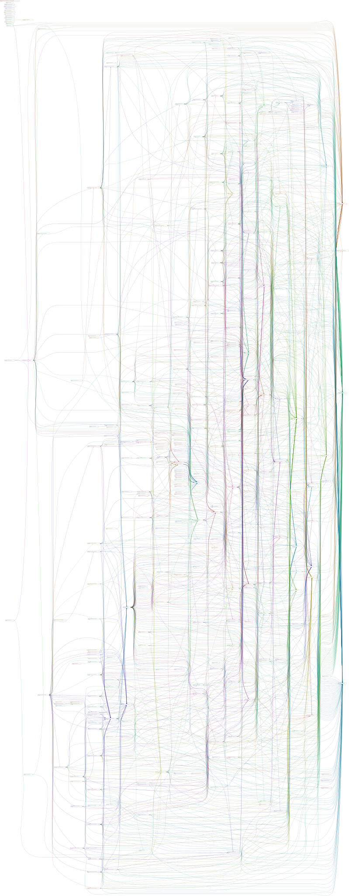

[](https://goreportcard.com/report/github.com/skycoin/skywire)


[](https://github.com/skycoin/skywire/releases/)
[](https://aur.archlinux.org/packages/skywire/)
[](https://aur.archlinux.org/packages/skywire-bin/)
[](https://api.securityscorecards.dev/projects/github.com/skycoin/skywire)
[](https://github.com/skycoin/skywire)
[](https://t.me/skywire)

**PLEASE ALWAYS USE THE [DEVELOP BRANCH](https://github.com/skycoin/skywire/tree/develop)**

# Skywire

Skywire is a fully open-source, privacy-focused suite of networking
tools developed by Skycoin. The public Skywire Network enables this
software to be developed and tested in real-world conditions, with
[daily rewards in Skycoin](rewards/mainnet_rules.md) ($SKY) distributed
to eligible participants.

## Why Skywire

The Internet's security stack is a thirty-year pile of patches over a
network that was designed without any. TCP/IP assumed a trusted
backbone. SMTP, DNS, and HTTP shipped plaintext. Every fix since —
TLS, X.509, Certificate Authorities, DNSSEC, DKIM, SPF, DMARC, HSTS,
CT logs — bolts confidentiality, identity, or authenticity onto a
layer that lacks it, via yet another layer that barely knows about the
ones above and below. CAs get compromised. DNS hijacks break TLS. BGP
hijacks break DNS. The address, the identity, and the name live in
three separate systems, and the browser juggles them on every page
load to keep the illusion together.

Skywire starts from a different premise: **the address is the
cryptographic identity.** From that one decision almost everything
else follows.

## Major features

* **Skywire is encrypted UDP & TCP.** Every byte between visors is
  wrapped in the Noise Protocol (ChaCha20-Poly1305). There is no
  plaintext mode, no opt-in TLS layer, no CA system; encryption is
  not a feature, it is a property of the network. Both TCP services
  and UDP datagrams carry end-to-end on the encrypted overlay.

  **For comparison — stream encryption at roughly this level:**
  - **cjdns / Yggdrasil** — encrypted IPv6 mesh, pubkey-derived
    address, no CA. Closest in design philosophy.
  - **Tor / I2P / Lokinet** — encrypted overlays focused on
    anonymity rather than general-purpose private transport.
  - **WireGuard / Nebula / Tailscale** — pubkey identity, AEAD
    over UDP, but per-pair configured rather than address-as-key.
  - **QUIC / HTTPS** — mandatory transport encryption, but identity
    is still bolted on via X.509 because IP addresses are not
    identities.

* **The public key is the address.** A 33-byte pubkey is what a peer
  dials; the Noise handshake proves the remote side holds the
  matching private key. Authentication is implicit because the name
  *is* the key — there is no external naming authority to consult,
  and no certificate to validate.

  **For comparison — address-as-cryptographic-identity:**
  - **Tor onion services** — `.onion` is the base32 pubkey hash.
  - **cjdns / Yggdrasil** — IPv6 derived from the pubkey hash.
  - **I2P destinations** — base32 IDs from the destination key.
  - **Hyperswarm / Hypercore** — pubkey is the discovery key.
  - **WireGuard / Tailscale** — pubkey identifies the peer, but the
    routable address is still an IP assigned by the coordinator.

  *What sets Skywire apart:* the property holds for every operation
  — transports, routes, app dial-out, CLI, hypervisor — not just
  for hidden services or routing alone.

* **DMSG: the anonymous relay layer.** Clients connect *out* to a
  DMSG server; neither side needs a public-facing port, and neither
  client learns the other's IP. The server passes the encrypted
  stream between them without being able to read it.

  **For comparison — identity-keyed relay between two clients:**
  - **Tor rendezvous / introduction points** — closest match;
    clients meet at a relay neither controls, no public port either
    side, IPs hidden from each other.
  - **Signal / WhatsApp servers** — server-mediated messaging;
    clients don't see each other's IPs. Same relay-without-read
    property, narrower scope (messaging only).
  - **libp2p Circuit Relay v2** — pubkey-keyed relay for
    NAT-traversed libp2p connections.
  - **TURN (WebRTC)** — relay when direct P2P fails, but not
    identity-keyed and operator can in principle MITM.

  *What sets Skywire apart:* DMSG is general-purpose encrypted
  stream relay used as the always-on baseline that lets any pubkey
  reach any other, *and* as the substrate Skywire's other
  discovery / control-plane services sit on.

* **Skynet: peer-to-peer, multi-hop, and multiplexed routing.**
  Routes carry Noise-encrypted packets end-to-end across one or
  more direct transports; intermediate visors see only their
  immediate neighbors, never the route's source or destination.
  Paths come from the route finder service or from local
  computation against the transport discovery graph. Multi-route
  mux is an opt-in capability that aggregates parallel routes for
  higher bandwidth.

  **For comparison — multi-hop pubkey-routed overlays:**
  - **Tor** — fixed 3-hop circuits, client-source-routed from the
    directory consensus.
  - **I2P** — garlic-routed tunables; tunnels selected locally
    from netDB.
  - **Lokinet** — Tor-style onion routing on Lokinet pubkeys.
  - **cjdns / Yggdrasil** — paths emerge from a self-organizing
    mesh (DHT labels / tree).
  - **Nym** — mixnet routing with cover traffic; anonymity-first.

  *What sets Skywire apart:* path construction is pluggable —
  consult a centralized route finder *or* compute locally from the
  transport discovery graph. Not fixed at three hops (Tor), not
  mesh-emergent (cjdns / Yggdrasil), not pooled (mixnets).

* **Skynet & DMSG port forwarding and reverse proxy.** Expose a
  local TCP service on a visor's pubkey, or forward a remote
  `pubkey:port` to a local port. Both directions work over Skynet
  routes (direct / multi-hop) or a DMSG relay, with per-pubkey
  whitelisting for access control and multiple named instances per
  visor.

  **For comparison — pubkey- / identity-keyed TCP tunneling:**
  - **ssh -L / ssh -R** — classic forwarding; identity is the SSH
    key, address is an IP.
  - **Tailscale Serve** — expose a local service on the tailnet;
    closest peer model.
  - **ngrok / Cloudflare Tunnel / Tailscale Funnel** — expose a
    local service to the clearnet via a provider's edge.
  - **WireGuard + iptables** — manual TCP forwarding inside a
    WireGuard mesh.

  *What sets Skywire apart:* forwarding works over either the
  direct-route plane *or* the anonymous DMSG relay, addressed
  purely by pubkey — no provider, no public IP, no DNS.

* **Resolving SOCKS5 proxy and mail bridge.** Bridges from legacy
  ecosystems into the overlay: the embedded `skynetweb` /
  `dmsgweb` SOCKS5 resolvers translate `<pk>.skynet` / `<pk>.dmsg`
  URLs for a browser, and `skymail-bridge` lets a standard SMTP
  sender deliver mail to a skywire mailbox.

  **For comparison — bridges from a legacy protocol into an
  overlay:**
  - **I2P HTTP / SOCKS proxy** — direct inspiration for the
    Skynet resolver; translates `.i2p` eepsite URLs.
  - **Tor SOCKS proxy** — resolves `.onion`.
  - **IPFS HTTP gateway** — bridges HTTPS clients to IPFS content.
  - **Matrix bridges (irc, slack, signal)** — relay between legacy
    chat protocols and Matrix federation.

  *What sets Skywire apart:* the bridges are first-class
  subsystems of the visor, sharing its pubkey identity and overlay
  encryption — the same identity model whether the visor is
  talking to another visor or fronting a legacy protocol on its
  behalf.

* **Remote monitoring and remote management over the overlay.**
  All over the same pubkey-authenticated transport:
  - `skywire cli dmsgpty` — SSH-equivalent interactive shell
    (`start`) and one-shot commands (`exec`) on a remote visor.
  - `skywire cli gotop --remote <pk>` — terminal activity monitor
    pulling CPU / memory / temperature from a remote visor over
    DMSG.
  - Hypervisor browser UI and `skywire cli visor tui` — manage
    clusters of visors from the browser or the terminal.

  No public IP, no SSH key sprawl, no jump host.

  **For comparison — remote access without a public IP or jump
  host:**
  - **Tailscale SSH** — pubkey-keyed SSH within a pubkey overlay.
    Closest peer for the shell side, no equivalent for the
    activity monitor or cluster UI.
  - **Headscale + SSH** — self-hosted Tailscale control + plain
    SSH on top.
  - **Cloudflare Tunnel + cloudflared** — provider-mediated
    tunnel.
  - **Teleport** — identity-aware access proxy; enterprise,
    closest match for cluster management.
  - **SSH + bastion host + htop/btop** — the legacy default;
    needs a public IP somewhere and stitches shell + monitor +
    cluster-mgmt together by hand.

  *What sets Skywire apart:* shell, activity monitor, and
  cluster UI are all first-class subcommands of the same CLI,
  reaching any visor by pubkey over the same overlay. No
  separate SSH key infrastructure, no separate tunneling agent,
  no provider account.

* **Native applications, managed by the visor.** VPN client and
  server, SOCKS5 proxy client and server (skysocks /
  skysocks-client), and skychat — a messenger with persistent
  history (CXO + bbolt) and group support. The visor starts,
  stops, lifecycle-manages, and registers them in service
  discovery.

  **For comparison — overlay networks that ship a managed app
  ecosystem:**
  - **I2P** — i2psnark (BitTorrent), I2P-Bote (email), Susimail,
    bundled and using the I2P identity. Closest peer.
  - **Tor Project apps** — Tor Browser, Tails, OnionShare — each
    a separate project rather than visor-managed.
  - **Lokinet + Session** — Session messenger uses the Loki
    identity but is a sibling project.
  - **Tailscale / WireGuard / Yggdrasil / cjdns** — pure
    transport; apps are external.

  *What sets Skywire apart:* apps are launched, supervised, and
  lifecycle-managed by the visor itself (`skywire cli visor app
  …`) — service discovery, transport, identity, and lifecycle
  all in one process.

* **Custom, private, and multi-deployment networks.** The whole
  service stack (transport discovery, route finder, service
  discovery, address resolver, DMSG discovery) is reproducible by a
  third party via
  [skywire-deployment](https://github.com/skycoin/skywire-deployment).
  Private Skywire networks can run on independent infrastructure,
  or additional deployments can layer on top of the public one for
  segmented or air-gapped environments. A hypervisor-embedded DMSG
  server keeps a private network running with no public deployment
  dependency after bootstrap.

  **For comparison — overlays with a self-hostable coordination
  plane:**
  - **Headscale** — self-hostable Tailscale control plane.
    Closest analogue.
  - **Nebula lighthouses** — coordination is just nodes the
    operator runs.
  - **Matrix homeservers** — fully self-hostable, federation by
    default.
  - **WireGuard alone** — no coordinator at all; manual peer
    config, often paired with Headscale / Netmaker.

  *What sets Skywire apart:* deployments compose — additional
  service stacks layer **on top of** the public Skywire deployment
  for segmented use, rather than replacing it.

## Skywire Control and Data Planes

[dmsg](https://github.com/skycoin/dmsg) (read "D-message") is the
**control plane** — the always-on relay layer over which visors
reach the public
[Skywire Network's](https://conf.skywire.skycoin.com) discovery
services, or a self-hosted equivalent. Skynet is the **data
plane** — direct peer-to-peer transports between visors and the
routes built across them.

## Skywire Network and Transports

Direct transports between visors come in two types: **STCPR**
(Skywire TCP Relay) and **SUDPH** (Skywire UDP Hole-punching).
An [automatic transport creation mechanism](pkg/visor/autoconnect.go),
enabled by default, establishes STCPR transports to
[public visors](https://sd.skycoin.com/api/services?type=visor)
and SUDPH transports to visors connected to those public visors,
populating each visor with enough transports for multi-hop
routing. Routes are set up by trusted route-setup nodes that
consult the route finder service over
[transports registered in the transport discovery](https://tpd.skywire.skycoin.com/all-transports).

## Skywire Routing

A route is a chain of one or more transports between visors and
may not transit the same public key twice, preventing data loops.
When a transport simultaneously carries data for multiple
unrelated source/destination pairs, traffic-correlation attacks
become correspondingly harder — compounding the per-hop visibility
limit the routing model already imposes. Route multiplexing
between the same endpoints is similar in concept to BitTorrent's
piece-level parallelism.

## Skywire Visor

The name 'visor' was chosen as a less ambiguous term than 'node' to
refer to the running Skywire process. The term 'node' is typically
reserved as a reference to the hardware on which Skywire is running,
in this ecosystem. A Skywire visor participates in transports and
provides an interface to applications which can be accessed over or
consume routes. The Skywire visor can also be configured to provide a
hypervisor web UI for remotely managing a cluster of Skywire visors /
nodes, typically referred to as a
[skyminer](https://www.skycoin.com/skyminer/).

For running and configuring a visor see
[docs/guides/visor.md](docs/guides/visor.md) and
[docs/guides/configuration.md](docs/guides/configuration.md).

## Skywire Cli (command line interface)

`skywire cli` is the primary interface to a running Skywire visor.
Skywire cli provides an interface to generate a JSON config file for
the Skywire visor, to control visor native applications, and to access
data from different Skywire services.

Full reference: [docs/skywire/cli/](docs/skywire/cli/README.md).

## Skywire Apps

Server-side apps auto-register in the
[proxy server](https://sd.skycoin.com/api/services?type=proxy) /
[VPN server](https://sd.skycoin.com/api/services?type=proxy)
service discovery on startup; clients dial them by pubkey over a
direct or multi-hop route.

Operator guides: [vpn](docs/guides/vpn.md), [socks5](docs/guides/socks5.md), [skynet](docs/guides/skynet.md).

## DmsgWeb – Anonymous port forwarding over DMSG

`skywire dmsg web` (client) and `skywire dmsg web srv` (server)
forward TCP ports over DMSG; the resolving SOCKS5 side was
inspired by I2P. Chaining a browser through a Skywire SOCKS5
proxy on top composes DMSG's relay anonymity with Skynet's
multi-hop routing.

## SkyNet – P2P port forwarding over Skywire

SkyNet is the counterpart to DmsgWeb — port forwarding over
Skynet routes (direct + multi-hop) rather than over a DMSG relay.
Server-side: expose local TCP services on the visor's pubkey,
with per-pubkey whitelisting for access control. Client-side:
forward a remote pubkey:port to a local port. Multiple server and
client instances run simultaneously under unique names.

Operator usage: [docs/guides/skynet.md](docs/guides/skynet.md).

## Skywire Rewards

The [Skywire reward system](https://theskywirenetwork.net) is the
distribution mechanism for [Skycoin](https://skycoin.com). Skycoin is
not 'mined' as with other cryptocurrencies; rewards in Skycoin ($SKY)
are distributed daily to eligible Skywire visors who meet the
[requirements for obtaining rewards](rewards/mainnet_rules.md).

Despite the terminology, Skywire visors do not process Skycoin
transactions. Skywire visors do not sync the Skycoin blockchain and
have no involvement in transaction processing. The only relationship
between skywire and the skycoin cryptocurrency is via the reward
system acting as the distribution mechanism for Skycoin.

Set a reward address:
```
skywire cli reward <skycoin-address>
```
Visors meeting uptime and eligibility requirements will receive daily
skycoin rewards for up to 8 visors per location / IP address. Only
package-based linux installations are currently supported for rewards.

## Documentation

Command-line reference, generated from the live cobra tree:

* [docs/skywire/](docs/skywire/README.md) — every command's `--help`,
  one markdown page per command, mirroring the subcommand hierarchy.
  Run `skywire doc` (or `make doc-gen`) from the repo root to
  regenerate after CLI changes.

Operator how-to guides:

* [docs/guides/install.md](docs/guides/install.md) — install via package, release binary, Docker, Nix, or `go install`
* [docs/guides/permissions.md](docs/guides/permissions.md) — VPN capabilities, sudoers, system survey
* [docs/guides/configuration.md](docs/guides/configuration.md) — `config gen`, hypervisor UI, network visualization
* [docs/guides/visor.md](docs/guides/visor.md) — run / supervise `skywire visor`, transports, runtime files
* [docs/guides/vpn.md](docs/guides/vpn.md) — Skywire VPN
* [docs/guides/socks5.md](docs/guides/socks5.md) — Skywire SOCKS5 proxy
* [docs/guides/skynet.md](docs/guides/skynet.md) — SkyNet port forwarding
* [docs/guides/manual-routing.md](docs/guides/manual-routing.md) — manual route creation, multi-hop, route-finder
* [docs/guides/testing.md](docs/guides/testing.md) — pre-PR `make format check`
* [docs/guides/release.md](docs/guides/release.md) — creating a GitHub release

Visor native applications:

* [API](docs/skywire_app_api.md)
* [skychat](cmd/apps/skychat/README.md)
* [skysocks](cmd/apps/skysocks/README.md) / [skysocks-client](cmd/apps/skysocks-client/README.md)
* [vpn-client](cmd/apps/vpn-client/README.md) / [vpn-server](cmd/apps/vpn-server/README.md)
* [skynet](cmd/apps/skynet/README.md) / [skynet-client](cmd/apps/skynet-client/README.md)

Example custom applications:

* [example-server-app](example/example-server-app/README.md)
* [example-client-app](example/example-client-app/README.md)

Further docs: [skywire wiki](https://github.com/skycoin/skywire/wiki).

## Dependencies

### Build Deps

* `golang` — install with your system package manager on most linux
  distributions, or follow [go.dev/doc/install](https://go.dev/doc/install).
  Basic setup of the `go` environment is further described
  [here](https://github.com/skycoin/skycoin/blob/develop/INSTALLATION.md#setup-your-gopath).
* `git` (optional)
* `musl` and `kernel-headers-musl` or equivalent — for static
  compilation; see [docs/static-builds.md](docs/static-builds.md).

### Visor Runtime Deps

* `glibc` or `libc6` — unless statically compiled.

### Testing Deps

* `golangci-lint`
* `goimports-reviser` from github.com/incu6us/goimports-reviser/v2
* `goimports` from golang.org/x/tools/cmd/goimports

## Dependency Graph

Made with [goda](https://github.com/loov/goda):

```
go run github.com/loov/goda@latest graph github.com/skycoin/skywire/... | dot -Tsvg -o docs/skywire-goda-graph.svg
```


