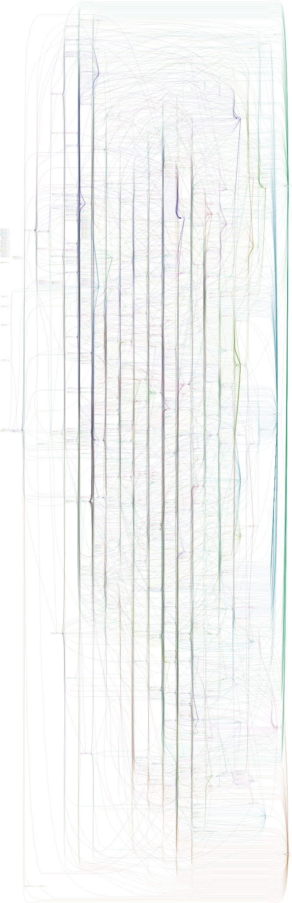

[](https://github.com/skycoin/skywire/releases/)
[](https://aur.archlinux.org/packages/skywire/)
[](https://aur.archlinux.org/packages/skywire-bin/)
[](https://api.securityscorecards.dev/projects/github.com/skycoin/skywire)
[](https://github.com/skycoin/skywire)
[](https://t.me/skywire)

**PLEASE ALWAYS USE THE [DEVELOP BRANCH](https://github.com/skycoin/skywire/tree/develop)**

# Skywire

Skywire is a fully open-source, privacy-focused suite of networking
tools developed by Skycoin. Every peer is addressed by its public key,
and all traffic between visors is end-to-end encrypted. The public
Skywire Network lets this software be developed and tested in
real-world conditions, with
[daily rewards in Skycoin](rewards/mainnet_rules.md) ($SKY) distributed
to eligible participants.

Contents:
[Quick start](#quick-start) ·
[Which Skywire](#which-skywire-to-run) ·
[Features](#features) ·
[Why Skywire](#why-skywire) ·
[Comparison](#how-skywire-compares) ·
[Borrowed ideas](#ideas-borrowed-and-adapted) ·
[Architecture](#architecture) ·
[Rewards](#skywire-rewards) ·
[Documentation](#documentation) ·
[Resource usage](#resource-usage) ·
[Dependencies](#dependencies)

## Quick start

Install as a package, release binary, Docker image, Nix flake or from
source. See [docs/guides/install.md](docs/guides/install.md), or the
[install command generator](docs/guides/install-generator.md).

With go installed, a visor runs straight from source. The bundled apps
(vpn, skysocks, skychat and others) run inside the visor process.

```
go run github.com/skycoin/skywire@develop cli config gen -r
go run github.com/skycoin/skywire@develop visor
```

Set a reward address and read the state of the running visor:

```
skywire cli reward <skycoin-address>
skywire cli visor state
```

Next steps are [visor.md](docs/guides/visor.md) and
[configuration.md](docs/guides/configuration.md).

## Which Skywire to run

The same visor runs three ways: as a native program, in a browser tab, and
in the Android app. They share the network but not every capability.

| | Native | Browser tab | Android |
|---|:-:|:-:|:-:|
| Dial out over every transport | ✓ | partial ¹ | ✓ |
| Accept inbound links (public visor) | ✓ | WebRTC only | partial ² |
| Exit for others (VPN, SOCKS5) | ✓ | ✗ | ✗ |
| VPN client | system wide | tab only ³ | system wide |
| SOCKS5 proxy client | ✓ | ✓ | ✓ |
| Multi-hop and multi-path routes | ✓ | ✓ | ✓ |
| Browse `.dmsg` and `.skynet` sites | ✓ | ✓ | ✗ ⁴ |
| Host a site, forward a port | ✓ | ✓ ⁵ | ✗ |
| Chat, voice calls, mail | ✓ | ✓ | chat and voice ⁶ |
| Remote shell and file mount (pty) | ✓ | ✓ ⁷ | ✗ |
| Dashboard | ✓ | ✓ | native screens |
| Desk (browser desktop) | ✓ | ✓ | ✗ |
| Skycoin wallet | ✓ | ✓ | ✓ |
| Runs in the background | ✓ | while the tab is open | ✓ |
| Rewards | ✓ | ✗ | ✗ |

¹ WebSocket, WebTransport, WebRTC and dmsg; a browser cannot open raw TCP or UDP.
² Carrier NAT blocks most inbound links, and public autoconnect is off by default to save battery and data.
³ A network stack inside the tab, for the tab's own pages.
⁴ The resolving proxy is in the core but not yet turned on or wired into the VPN.
⁵ On the tab's virtual loopback rather than the computer's.
⁶ The mailbox runs in the core but the app has no mail screen yet.
⁷ The tab hosts a websh shell and its own files rather than the computer's.

## Features

* **Skywire is encrypted UDP & TCP.** Every byte between visors is
  wrapped in the Noise Protocol (ChaCha20-Poly1305). There is no
  plaintext mode, no opt-in TLS layer, no CA system; encryption is
  not a feature, it is a property of the network. Both TCP services
  and UDP datagrams carry end-to-end on the encrypted overlay.

* **The public key is the address.** A 33-byte pubkey is what a peer
  dials; the Noise handshake proves the remote side holds the
  matching private key. Authentication is implicit because the name
  *is* the key — there is no external naming authority to consult,
  and no certificate to validate. The property holds for every
  operation — transports, routes, app dial-out, CLI, hypervisor —
  not just for hidden services or routing alone.

* **DMSG: the anonymous relay layer.** Clients connect *out* to a
  DMSG server; neither side needs a public-facing port, and neither
  client learns the other's IP. The server passes the encrypted
  stream between them without being able to read it. DMSG is the
  always-on baseline that lets any pubkey reach any other, and the
  substrate Skywire's discovery and control-plane services sit on.

* **Skynet: peer-to-peer, multi-hop, and multiplexed routing.**
  Routes carry Noise-encrypted packets end-to-end across one or
  more direct transports; intermediate visors see only their
  immediate neighbors, never the route's source or destination.
  Paths come from the route finder service, from local computation
  against the transport discovery graph, or — for two-hop routes —
  from the destination's own transport list, which it hands over to
  a query signed by a route setup node. Multi-route mux is an opt-in
  capability that runs several whole routes at once, reorders and
  retransmits across them, and schedules each packet onto the route
  predicted to deliver it soonest.

* **Skynet & DMSG port forwarding and reverse proxy.** Expose a
  local TCP service on a visor's pubkey, or forward a remote
  `pubkey:port` to a local port. Both directions work over Skynet
  routes (direct / multi-hop) or a DMSG relay, with per-pubkey
  whitelisting for access control and multiple named instances per
  visor.

* **Resolving SOCKS5 proxy and mail bridge.** Bridges from legacy
  ecosystems into the overlay: the embedded `skynetweb` /
  `dmsgweb` SOCKS5 resolvers translate `<pk>.skynet` / `<pk>.dmsg`
  URLs for a browser, and `skymail-bridge` lets a standard SMTP
  sender deliver mail to a skywire mailbox.

* **Remote monitoring and remote management over the overlay.**
  All over the same pubkey-authenticated transport:
  - `skywire cli pty` — SSH-equivalent interactive shell
    (`shell`, `start`) and one-shot commands (`exec`) on a remote visor.
  - `skywire cli gotop --remote <pk>` — terminal activity monitor
    pulling CPU / memory / temperature from a remote visor over
    DMSG.
  - Hypervisor browser UI and `skywire cli visor` (with `--via dmsg://<pk>`) — manage
    clusters of visors from the browser or the terminal.

  No public IP, no SSH key sprawl, no jump host.

* **Native applications, managed by the visor.** VPN client and
  server, SOCKS5 proxy client and server (skysocks /
  skysocks-client), and skychat — a messenger with persistent
  history (CXO + bbolt) and group support. The visor starts,
  stops, lifecycle-manages, and registers them in service
  discovery.

* **Custom, private, and multi-deployment networks.** The whole
  service stack (transport discovery, route finder, service
  discovery, address resolver, DMSG discovery) is reproducible by a
  third party via
  [skywire-deployment](https://github.com/skycoin/skywire-deployment).
  Private Skywire networks can run on independent infrastructure,
  or additional deployments can layer on top of the public one for
  segmented or air-gapped environments. A hypervisor-embedded DMSG
  server keeps a private network running with no public deployment
  dependency after bootstrap. Visors follow their deployment's
  service keys from its config service's signed feed, so a
  deployment can change them without a release.

## Why Skywire

The Internet's security stack is a thirty-year pile of patches over a
network that was designed without any. TCP/IP assumed a trusted
backbone. SMTP, DNS, and HTTP shipped plaintext. Every fix since —
TLS, X.509, Certificate Authorities, DNSSEC, DKIM, SPF, DMARC, HSTS,
CT logs — bolts confidentiality, identity, or authenticity onto a
layer that lacks it, via yet another layer that barely knows about the
ones above and below. CAs get compromised. DNS hijacks break TLS. BGP
hijacks break DNS. The address, the identity, and the name live in
three separate systems, and the browser juggles them on every page
load to keep the illusion together.

Skywire starts from a different premise: **the address is the
cryptographic identity.** From that one decision almost everything
else follows.
## How Skywire compares

Each column is defined in the legend under the tables. The first table
is about reaching peers and the second is about what you do with the
network. Footnotes apply to both.

### Reach

| | Key | No port | Hole punch | Multi-hop | Multi-path | IP |
|---|:-:|:-:|:-:|:-:|:-:|:-:|
| **Skywire** | ✓ | ✓ | ✓ | ✓ | ✓ | ✓ |
| [Tor](https://www.torproject.org/) | ✓ | ✓ | ✗ | ✓ | ✓ ² | ✗ |
| [I2P](https://geti2p.net/) | ✓ | ✓ | ✓ | ✓ | ✓ | ✗ |
| [Lokinet](https://lokinet.org/) | ✓ | ✓ | ✗ | ✓ | ✗ | ✓ |
| [cjdns](https://github.com/cjdelisle/cjdns) | ✓ | ✓ | ✗ | ✓ | ✗ | ✓ |
| [Yggdrasil](https://yggdrasil-network.github.io/) | ✓ | ✓ | ✗ | ✓ | ✗ | ✓ |
| [Reticulum](https://reticulum.network/) | ✓ | ✓ | ✗ | ✓ | ✗ | ✗ |
| [iroh](https://www.iroh.computer/) | ✓ | ✓ | ✓ | ✗ | ✗ ³ | ✗ |
| [libp2p](https://libp2p.io/) | ✓ | ✓ | ✓ | ✗ | ✗ | ✗ |
| [Tailscale](https://tailscale.com/) | ✗ | ✓ | ✓ | ✗ | ✗ | ✓ |
| [ZeroTier](https://www.zerotier.com/) | ✗ | ✓ | ✓ | ✗ | ✓ ⁶ | ✓ |
| [Nebula](https://github.com/slackhq/nebula) | ✗ | ✓ | ✓ | ✗ | ✗ | ✓ |
| [WireGuard](https://www.wireguard.com/) | ✗ | ✗ | ✗ | ✗ | ✗ | ✓ |

### Use

| | Exit | Serve | Browser | Private | No central | Rewards |
|---|:-:|:-:|:-:|:-:|:-:|:-:|
| **Skywire** | ✓ | ✓ | ✓ | ✓ | ✗ ¹ | ✓ |
| [Tor](https://www.torproject.org/) | ✓ | ✓ | ✗ | ✗ | ✗ | ✗ |
| [I2P](https://geti2p.net/) | ✓ | ✓ | ✗ | ✗ | ✓ | ✗ |
| [Lokinet](https://lokinet.org/) | ✓ | ✓ | ✗ | ✗ | ✓ | ✓ |
| [cjdns](https://github.com/cjdelisle/cjdns) | ✗ | ✓ | ✗ | ✓ | ✓ | ✗ |
| [Yggdrasil](https://yggdrasil-network.github.io/) | ✗ | ✓ | ✗ | ✓ | ✓ | ✗ |
| [Reticulum](https://reticulum.network/) | ✗ | ✓ | ✗ | ✓ | ✓ | ✗ |
| [iroh](https://www.iroh.computer/) | ✗ | ✓ | ✓ ⁴ | ✓ | ✓ | ✗ |
| [libp2p](https://libp2p.io/) | ✗ | ✓ | ✓ | ✓ | ✓ | ✗ |
| [Tailscale](https://tailscale.com/) | ✓ | ✗ | ✓ | ✓ ⁵ | ✗ | ✗ |
| [ZeroTier](https://www.zerotier.com/) | ✗ | ✗ | ✗ | ✓ | ✗ | ✗ |
| [Nebula](https://github.com/slackhq/nebula) | ✗ | ✗ | ✗ | ✓ | ✗ | ✗ |
| [WireGuard](https://www.wireguard.com/) | ✗ | ✗ | ✗ | ✓ | ✓ | ✗ |

- **Key** (dial by key) — a peer is reached by its public key (or an address
  derived from it), not by an IP an operator assigned.
- **No port** (no open port) — a node behind NAT with no inbound port is still
  reachable.
- **Hole punch** (hole punching) — two nodes behind NAT can open a direct link
  between themselves, without a relay carrying the traffic.
- **Multi-hop** — traffic can be forwarded through other peers, so two
  nodes with no direct link still connect.
- **Multi-path** — one connection's traffic travels over several paths
  at the same time.
- **IP** (carries IP) — arbitrary IP traffic, as a VPN or virtual interface.
- **Exit** (internet exit) — a node can carry other nodes' traffic out to the
  internet as a built-in feature, not by hand-configured routing.
- **Serve** (serve by key) — a local service can be published at the node's key.
- **Browser** (in browser) — a node or client runs inside a web browser.
- **Private** (private network) — a fully separate network can run on your own
  infrastructure.
- **No central** (no central service) — runs with no operator-run discovery or
  coordination server.
- **Rewards** (node rewards) — people running nodes are paid for it.

¹ Each deployment runs discovery, route-finding and relay services,
but anyone can run a deployment.

² Conflux splits one stream over two circuits to the same exit.

³ iroh keeps standby paths behind a single active one.

⁴ Through a relay only; browsers cannot send raw UDP.

⁵ With Headscale, a third-party coordination server.

⁶ Bonding across a node's own network interfaces.

### Carriers

What each one's links run over, counting relayed links (iroh's
relays, Tailscale's DERP, ZeroTier's TCP fallback) and Tor's bridge
transports. **UDP** means a protocol of its own over UDP; **QUIC** is
listed separately. The second table covers non-IP media.

| | TCP | UDP | QUIC | WebSocket | WebTransport | WebRTC |
|---|:-:|:-:|:-:|:-:|:-:|:-:|
| **Skywire** | ✓ | ✓ | ✓ | ✓ | ✓ | ✓ |
| [Tor](https://www.torproject.org/) | ✓ | ✗ | ✗ | ✓ | ✗ | ✓ |
| [I2P](https://geti2p.net/) | ✓ | ✓ | ✗ | ✗ | ✗ | ✗ |
| [Lokinet](https://lokinet.org/) | ✗ | ✓ | ✗ | ✗ | ✗ | ✗ |
| [cjdns](https://github.com/cjdelisle/cjdns) | ✗ | ✓ | ✗ | ✗ | ✗ | ✗ |
| [Yggdrasil](https://yggdrasil-network.github.io/) | ✓ | ✗ | ✓ | ✓ | ✗ | ✗ |
| [Reticulum](https://reticulum.network/) | ✓ | ✓ | ✗ | ✗ | ✗ | ✗ |
| [iroh](https://www.iroh.computer/) | ✗ | ✗ | ✓ | ✓ | ✗ | ✗ |
| [libp2p](https://libp2p.io/) | ✓ | ✗ | ✓ | ✓ | ✓ | ✓ |
| [Tailscale](https://tailscale.com/) | ✓ | ✓ | ✗ | ✓ | ✗ | ✗ |
| [ZeroTier](https://www.zerotier.com/) | ✓ | ✓ | ✗ | ✗ | ✗ | ✗ |
| [Nebula](https://github.com/slackhq/nebula) | ✗ | ✓ | ✗ | ✗ | ✗ | ✗ |
| [WireGuard](https://www.wireguard.com/) | ✗ | ✓ | ✗ | ✗ | ✗ | ✗ |

| | Raw Ethernet | Serial | Packet radio / LoRa |
|---|:-:|:-:|:-:|
| **Skywire** | ✗ | ✗ | ✗ |
| [Tor](https://www.torproject.org/) | ✗ | ✗ | ✗ |
| [I2P](https://geti2p.net/) | ✗ | ✗ | ✗ |
| [Lokinet](https://lokinet.org/) | ✗ | ✗ | ✗ |
| [cjdns](https://github.com/cjdelisle/cjdns) | ✓ | ✗ | ✗ |
| [Yggdrasil](https://yggdrasil-network.github.io/) | ✗ | ✗ | ✗ |
| [Reticulum](https://reticulum.network/) | ✗ | ✓ | ✓ |
| [iroh](https://www.iroh.computer/) | ✗ | ✗ | ✗ |
| [libp2p](https://libp2p.io/) | ✗ | ✗ | ✗ |
| [Tailscale](https://tailscale.com/) | ✗ | ✗ | ✗ |
| [ZeroTier](https://www.zerotier.com/) | ✗ | ✗ | ✗ |
| [Nebula](https://github.com/slackhq/nebula) | ✗ | ✗ | ✗ |
| [WireGuard](https://www.wireguard.com/) | ✗ | ✗ | ✗ |

## Ideas borrowed and adapted

Much of Skywire's route multiplexing reuses ideas that proved themselves
elsewhere. Each one below is named as the source in the code or design docs,
and each had to change to fit Skywire, where a "path" is a multi-hop route
through other visors rather than a network interface. Read the linked files
for the detail.

### Multiplexing one download or upload over several tunnels (skysocks)

These come from BitTorrent, where a client fetches pieces of one file from
many peers ([route-spread-policy.md](docs/design/route-spread-policy.md)).

- **Endgame mode.** The last chunks of an object are duplicated onto an idle
  tunnel, so one slow route does not decide when the object finishes. Skywire
  duplicates only when fewer chunks remain than tunnels, and only onto the
  fastest idle tunnel. Off by default (`spread.endgame`).
  [spread.go](pkg/skysocks/spread.go)
- **Snubbing and optimistic unchoke.** A tunnel that stops delivering is
  benched and its chunks are fetched elsewhere, then it is retried with a
  single chunk. Skywire snubs whole tunnels rather than requests, counts any
  byte or ack as progress, and waits at least twice the tunnel's smoothed RTT
  so a far route is not mistaken for a dead one.
  [tunnel_snub.go](pkg/skysocks/tunnel_snub.go)
- **Request pipelining.** Each tunnel keeps as many chunks in flight as its own
  measured rate times RTT can hold, one on a near tunnel and several on a far
  one. Off by default (`chunk.depth_dynamic`, `upload.depth_dynamic`).
  [tunnel_depth.go](pkg/skysocks/tunnel_depth.go)
- **Per-peer limits.** BitTorrent's per-peer caps became `spread.max_share`
  (no route carries more than a set share of an object) and
  `spread.min_routes`. The privacy reason for them, an even split so no single
  route sees most of the traffic, is Skywire's own and has no BitTorrent
  equivalent.
- **HTTP range requests** (RFC 7233). One download is split into parallel
  ranged requests over separate routes and reassembled by offset, so no
  reorder buffer is needed. [rangesplit.go](pkg/skysocks/rangesplit.go)

### Striping one stream over several route legs (router)

These come from multipath TCP, QUIC and TCP congestion control research
([mux_aggregation_rfc.md](docs/mux_aggregation_rfc.md)).

- **ECF scheduling** (Lim et al., CoNEXT 2017), the default leg scheduler.
  It sends on the fastest leg unless waiting would cost more than using a
  slower one. Skywire has no congestion window, so each leg's capacity is its
  measured rate times RTT plus an in-flight estimate.
  [transport_selector.go](pkg/router/transport_selector.go)
- **OTIAS** (Yang et al.), an alternative scheduler built on the same per-leg
  estimates. [mux_scheduler.go](pkg/router/mux_scheduler.go)
- **RACK-TLP loss detection** (RFC 8985). The retransmit threshold follows
  the slowest active leg's ack delay, and a tail-loss probe resends the end
  of a burst after about twice the slowest leg's RTT.
  [rack_tlp.go](pkg/router/rack_tlp.go), [sack.go](pkg/router/sack.go)
- **Karn's rule.** Retransmitted packets never feed the RTT estimate.
- **Shared-bottleneck detection** (RFC 8382). Legs whose one-way delays move
  together share an uplink further out, so they are not counted as separate
  capacity. [bottleneck.go](pkg/router/bottleneck.go)
- **BBR's minimum RTT and application-limited rule.** A sliding minimum RTT
  per leg, and a goodput check so queueing delay is not read as a bad leg.
  [leg_rtt_window.go](pkg/router/leg_rtt_window.go)
- **MPTCP's receive-buffer rule** (twice the sum of bandwidths times the
  largest RTT) sizes the reorder window. [route_mux.go](pkg/router/route_mux.go)
- **Forward error correction.** Reed-Solomon repair symbols sent across legs
  let the receiver rebuild a frame stuck on a slow leg instead of waiting for
  it. [fec.go](pkg/router/fec.go)
- **Coupled congestion control and LEDBAT.** The `coupled` routing-policy
  preset is modeled on MPTCP's LIA and OLIA, and `ledbat` on RFC 6817. They
  run as policy scripts that grow or shrink the number of legs.
  [preset.go](pkg/router/policy/preset/preset.go)

### Elsewhere

- **libp2p circuit relays.** dmsg servers cap relayed sessions per peer as
  well as globally, and count refusals by reason.
  [entity_common.go](pkg/dmsg/dmsg/entity_common.go)
- **WireGuard.** Datagram routes use ChaCha20-Poly1305 with an RFC 6479
  anti-replay window and WireGuard's two-minute rekey.
  [datagram_crypto.go](pkg/router/datagram_crypto.go)
- **Noise with ML-KEM.** The dmsg handshake is Noise KK combined with
  post-quantum ML-KEM-768. [pq-hybrid-noise-handshake.md](docs/design/pq-hybrid-noise-handshake.md)
- **Happy Eyeballs** (RFC 8305) for racing dial attempts to a dmsg server.

## Architecture

### Skywire Control and Data Planes

[dmsg](https://github.com/skycoin/dmsg) (read "D-message") is the
**control plane** — the always-on relay layer over which visors
reach the public
[Skywire Network's](https://conf.skywire.skycoin.com) discovery
services, or a self-hosted equivalent. Skynet is the **data
plane** — direct peer-to-peer transports between visors and the
routes built across them.

### Skywire Network and Transports

Direct transports between visors come in two types: **STCPR**
(Skywire TCP Relay) and **SUDPH** (Skywire UDP Hole-punching).
An [automatic transport creation mechanism](pkg/visor/autoconnect.go),
enabled by default, establishes STCPR transports to
[public visors](https://sd.skycoin.com/api/services?type=visor)
and SUDPH transports to visors connected to those public visors,
populating each visor with enough transports for multi-hop
routing. Routes are set up by trusted route-setup nodes that
consult the route finder service over
[transports registered in the transport discovery](https://tpd.skywire.skycoin.com/all-transports).

### Skywire Routing

A route is a chain of one or more transports between visors and
may not transit the same public key twice, preventing data loops.
When a transport simultaneously carries data for multiple
unrelated source/destination pairs, traffic-correlation attacks
become correspondingly harder — compounding the per-hop visibility
limit the routing model already imposes. Route multiplexing
between the same endpoints is similar in concept to BitTorrent's
piece-level parallelism.

### Skywire Visor

The name 'visor' was chosen as a less ambiguous term than 'node' to
refer to the running Skywire process. The term 'node' is typically
reserved as a reference to the hardware on which Skywire is running,
in this ecosystem. A Skywire visor participates in transports and
provides an interface to applications which can be accessed over or
consume routes. The Skywire visor can also be configured to provide a
hypervisor web UI for remotely managing a cluster of Skywire visors /
nodes, typically referred to as a
[skyminer](https://www.skycoin.com/skyminer/).

For running and configuring a visor see
[docs/guides/visor.md](docs/guides/visor.md) and
[docs/guides/configuration.md](docs/guides/configuration.md).

### Skywire Cli (command line interface)

`skywire cli` is the primary interface to a running Skywire visor.
Skywire cli provides an interface to generate a JSON config file for
the Skywire visor, to control visor native applications, and to access
data from different Skywire services.

Full reference: [docs/skywire/cli/](docs/skywire/cli/README.md).

### Skywire Apps

Server-side apps auto-register in the
[proxy server](https://sd.skycoin.com/api/services?type=proxy) /
[VPN server](https://sd.skycoin.com/api/services?type=vpn)
service discovery on startup; clients dial them by pubkey over a
direct or multi-hop route.

Operator guides: [vpn](docs/guides/vpn.md), [socks5](docs/guides/socks5.md), [skynet](docs/guides/skynet.md).

### DmsgWeb – Anonymous port forwarding over DMSG

`skywire dmsg web` (client) and `skywire dmsg web srv` (server)
forward TCP ports over DMSG; the resolving SOCKS5 side was
inspired by I2P. Chaining a browser through a Skywire SOCKS5
proxy on top composes DMSG's relay anonymity with Skynet's
multi-hop routing.

### SkyNet – P2P port forwarding over Skywire

SkyNet is the counterpart to DmsgWeb — port forwarding over
Skynet routes (direct + multi-hop) rather than over a DMSG relay.
Server-side: expose local TCP services on the visor's pubkey,
with per-pubkey whitelisting for access control. Client-side:
forward a remote pubkey:port to a local port. Multiple server and
client instances run simultaneously under unique names.

Operator usage: [docs/guides/skynet.md](docs/guides/skynet.md).

## Skywire Rewards

The [Skywire reward system](https://theskywirenetwork.net) is the
distribution mechanism for [Skycoin](https://skycoin.com). Skycoin is
not 'mined' as with other cryptocurrencies; rewards in Skycoin ($SKY)
are distributed daily to eligible Skywire visors who meet the
[requirements for obtaining rewards](rewards/mainnet_rules.md).

Despite the terminology, Skywire visors do not process Skycoin
transactions. Skywire visors do not sync the Skycoin blockchain and
have no involvement in transaction processing. The only relationship
between skywire and the skycoin cryptocurrency is via the reward
system acting as the distribution mechanism for Skycoin.

Set a reward address:
```
skywire cli reward <skycoin-address>
```
Visors meeting uptime and eligibility requirements will receive daily
skycoin rewards for up to 8 visors per location / IP address. Only
package-based linux installations are currently supported for rewards.

## Documentation

Command-line reference, generated from the live cobra tree:

* [docs/skywire/](docs/skywire/README.md) — every command's `--help`,
  one markdown page per command, mirroring the subcommand hierarchy.
  Run `skywire doc` (or `make doc-gen`) from the repo root to
  regenerate after CLI changes.

Operator how-to guides:

* [docs/guides/install.md](docs/guides/install.md) — install via package, release binary, Docker, Nix, or `go install`
* [docs/guides/permissions.md](docs/guides/permissions.md) — VPN capabilities, sudoers, system survey
* [docs/guides/configuration.md](docs/guides/configuration.md) — `autoconfig` vs `config gen`; see also [hypervisor.md](docs/guides/hypervisor.md) and [config-gen.md](docs/guides/config-gen.md)
* [docs/guides/visor.md](docs/guides/visor.md) — run / supervise `skywire visor`, transports, runtime files
* [docs/guides/vpn.md](docs/guides/vpn.md) — Skywire VPN
* [docs/guides/socks5.md](docs/guides/socks5.md) — Skywire SOCKS5 proxy
* [docs/guides/skynet.md](docs/guides/skynet.md) — SkyNet port forwarding
* [docs/guides/manual-routing.md](docs/guides/manual-routing.md) — manual route creation, multi-hop, route-finder
* [docs/guides/testing.md](docs/guides/testing.md) — pre-PR `make format check`
* [docs/guides/release.md](docs/guides/release.md) — creating a GitHub release

Visor native applications:

* [overview](docs/apps-overview.md), [implementation guide](docs/app_implement_guidance.md)
* [skychat](cmd/apps/skychat/README.md)
* [skysocks](cmd/apps/skysocks/README.md) / [skysocks-client](cmd/apps/skysocks-client/README.md)
* [vpn-client](cmd/apps/vpn-client/README.md) / [vpn-server](cmd/apps/vpn-server/README.md)
* [skynet](cmd/apps/skynet/README.md) / [skynet-client](cmd/apps/skynet-client/README.md)

Example custom applications:

* [example-server-app](example/example-server-app/README.md)
* [example-client-app](example/example-client-app/README.md)

Further docs: [skywire wiki](https://github.com/skycoin/skywire/wiki).

## Resource usage

Approximate memory footprint, read from live fleet nodes over dmsg with pprof
(in-use heap) and, for the dmsg server, the process's peak RSS.

Measured 2026-10-04 on fleet visors running v1.3.97 and v1.3.98, and on a
dmsg server running v1.3.98-103-g960cf0872.

- **Visor:** about **215 to 240 MB of live heap**, and nearly flat in the
  number of transports: three healthy visors with 28, 29 and 232 transports
  held 232, 237 and 216 MB. The base dominates. Its two largest fixed parts
  are the embedded GeoIP database behind the hypervisor's transport map
  (~59 MB) and the gzipped wasm visor the hypervisor serves (~38 MB). In June
  2026 (v1.3.66) a visor was ~110 MB plus ~90 KB per transport.
- **dmsg server:** about **0.5 MB of RSS per connected client** (the
  per-client noise session, yamux mux and relay stream buffers). A server with
  1213 clients peaked at 650 MB RSS, about 0.54 MB per client including its
  base. A busy relay must be sized for its peak client load. Cap a relay's
  `max_sessions` to bound its footprint and shed excess load to other servers.

## Dependencies

### Build Deps

* `golang` (go 1.27 or newer, see `go.mod`) — install with your system package manager on most linux
  distributions, or follow [go.dev/doc/install](https://go.dev/doc/install).
  Basic setup of the `go` environment is further described
  [here](https://github.com/skycoin/skycoin/blob/develop/INSTALLATION.md#setup-your-gopath).
* `git` (optional)
* `musl` and `kernel-headers-musl` or equivalent — for static
  compilation; see [docs/guides/install.md](docs/guides/install.md).

### Visor Runtime Deps

* `glibc` or `libc6` — unless statically compiled.

### Testing Deps

* `golangci-lint`
* `goimports-reviser` from github.com/incu6us/goimports-reviser/v2
* `goimports` from golang.org/x/tools/cmd/goimports

## Dependency Graph

Reflects skywire v1.3.98-103-g960cf0872 (commit `960cf0872`), generated 2026-10-04.

Made with [goda](https://github.com/loov/goda):

```
go run github.com/loov/goda@latest graph github.com/skycoin/skywire/... | dot -Tsvg -o docs/skywire-goda-graph.svg
```



## Lines of Code

Reflects skywire v1.3.98-103-g960cf0872 (commit `960cf0872`), generated 2026-10-04.

Made with [gocloc](https://github.com/hhatto/gocloc) (excludes `vendor/`, `node_modules/`, `.git/`):

```
gocloc --not-match-d='(vendor|node_modules|\.git)' .
```

```
-------------------------------------------------------------------------------
Language                     files          blank        comment           code
-------------------------------------------------------------------------------
Go                            3151          72929         143399         471893
JSON                           764             96              0         433006
Markdown                       827          14860             42          54059
TypeScript                     184           4549           7732          28000
HTML                           104           2084           3897          25356
Kotlin                         160           2560           6930          24703
JavaScript                      36            954           6338          13099
Sass                            91           1350            458           7486
Bourne Shell                    37            281           2650           5166
Plain Text                      21            152              0           2781
XML                             21            239            452           2431
BASH                            48            448           1032           2261
YAML                            10             39            292           1196
Makefile                         4            187            167            850
Protocol Buffers                 1             76            506            402
Starlark                        28             73            546            376
Nix                              3             38            160            245
Batch                            3             32              0            181
WiX                              2             36             49            156
PowerShell                       1             11              0             91
TOML                             1              2             15             52
CSS                              4              4              4             31
-------------------------------------------------------------------------------
TOTAL                         5501         101000         174669        1073821
-------------------------------------------------------------------------------
```

## License

Skywire is licensed under the [GNU Affero General Public License v3.0](LICENSE)
(AGPL-3.0-only). A commercial license is also available for use that cannot
comply with the AGPL — see [COMMERCIAL-LICENSE.md](COMMERCIAL-LICENSE.md).
Third-party code under `vendor/` keeps its own license.
