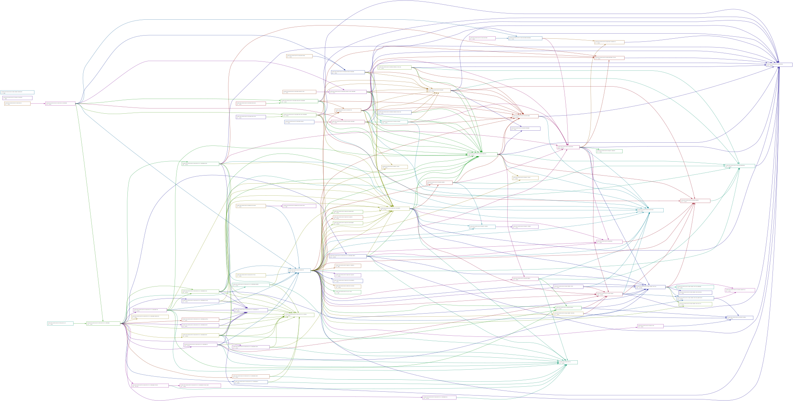

[](https://goreportcard.com/report/github.com/skycoin/skywire)


[](https://github.com/skycoin/skywire/releases/)
[](https://aur.archlinux.org/packages/skywire/)
[](https://aur.archlinux.org/packages/skywire-bin/)
[](https://api.securityscorecards.dev/projects/github.com/skycoin/skywire)
[](https://github.com/skycoin/skywire)
[](https://t.me/skywire)


Compiling Skywire requires a Golang version of at least `1.16`.

# Skywire

* [Commands and Subcommands](#commands-and-subcommands)
* [App documentation](#app-documentation)
* [Installing Skywire](#installing-skywire)
* [Dependencies](#dependencies)
  * [Build Deps](#build-deps)
  * [Runtime Deps](#runtime-deps)
  * [Testing Deps](#testing-deps)
* [Testing](#testing)
* [Compiling](#compiling)
* [Config Gen](#config-gen)
* [Build docker image](#build-docker-image)
* [Skywire Configuration in\-depth](#skywire-configuration-in-depth)
  * [Expose hypervisorUI](#expose-hypervisorui)
  * [Add remote hypervisor](#add-remote-hypervisor)
* [Files and folders created by skywire at runtime](#files-and-folders-created-by-skywire-at-runtime)
* [Run skywire\-visor](#run-skywire-visor)
* [Run from source](#run-from-source)
  * [Port forwarding over skywire](#port-forwarding-over-skywire)
  * [Transport setup](#transport-setup)
  * [Routing Rules](#routing-rules)
  * [Using the Skywire VPN](#using-the-skywire-vpn)
  * [Using the Skywire SOCKS5 proxy client](#using-the-skywire-socks5-proxy-client)
* [Skycoin Rewards](#skycoin-rewards)
* [Linux Packages](#linux-packages)
* [How to create a GitHub release](#how-to-create-a-github-release)

## Commands and Subcommands

Documentation of all commands and subcommands is available in the command documentation README:

* [skywire](cmd/skywire/README.md)
* [skywire-cli](cmd/skywire-cli/README.md)
* [skywire-visor](cmd/skywire-visor/README.md)

## Visor Native Applications

Visor apps are not executed directly by the user, but hosted by the visor process.

* [API](docs/skywire_app_api.md)
* [skychat](cmd/apps/skychat/README.md)
* [skysocks](cmd/apps/skysocks/README.md)
* [skysocks-client](cmd/apps/skysocks-client/README.md)
* [vpn-client](cmd/apps/vpn-client/README.md)
* [vpn-server](cmd/apps/vpn-server/README.md)
* [example-server-app](example/example-server-app/README.md)
* [example-client-app](example/example-client-app/README.md)

Further documentation can be found in the [skywire wiki](https://github.com/skycoin/skywire/wiki).

## Installing Skywire from Release

Releases for windows & macOS are available from the [release section](https://github.com/skycoin/skywire/releases/)

Install as a package on debian or arch linux: [Package Installation Guide](https://github.com/skycoin/skywire/wiki/Skywire-Package-Installation)

[Binary Releases](https://github.com/skycoin/skywire/releases) for many platforms and architectures are provided if none of the other installation methods are preferred.

## Dependencies

### Build Deps

* `golang`

`golang` or `go` can be installed with your system package manager on most linux distributions. Alternatively, follow the procedure at [go.dev/doc/install](https://go.dev/doc/install) to install golang.

Basic setup of the `go` environment is further described [here](https://github.com/skycoin/skycoin/blob/develop/INSTALLATION.md#setup-your-gopath).

* `git` (optional)

* `musl` and `kernel-headers-musl` or equivalent - _for static compilation_

For more information on static compilation, see [docs/static-builds.md](docs/static-builds.md).

### Runtime Deps

* ` glibc` or `libc6` _unless statically compiled_

### Testing Deps

* `golangci-lint`
* `goimports-reviser` from github.com/incu6us/goimports-reviser/v2
* `goimports` from golang.org/x/tools/cmd/goimports

## Testing

Before pushing commits to a pull request, its customary in case of edits to any of the golang source code to run the following:

```
make format check
```

`make check` will run `make test` as well. To explicitly run tests, use `make test`.

## Compiling

To compile skywire directly from cloned git sources:

```
git clone https://github.com/skycoin/skywire
cd skywire
#for the latest commits, check out the develop branch
git checkout develop
make build
```

To compile skywire directly from source archive, first download the latest source archive from the release section with your browser or another utility. Extract it with an archiving utility, enter the directory where the sources were extracted, and run `make build-merged` or `make build-merged-windows`.


`make build-merged` and `make build-merged-windows` builds a single binary containing all utilities and apps with `go build`

the `skywire` binary will populate in the current directory.

Build output:

```
└──skywire
```

For more options, run `make help`.

## Config Gen

To run skywire from this point, first generate a config.

```
./skywire cli config gen -birx
```
`-b --bestproto` use the best protocol (dmsg | direct) to connect to the skywire production deployment
`-i --ishv` create a  local hypervisor configuration
`-r --regen` regenerate a config which may already exist, retaining the keys
`-x --retainhv` retain any remote hypervisors which are set in the config

More options for configuration are displayed with `./skywire cli config gen -all`.


## Build docker image
```
$ ./ci_scripts/docker-push.sh -t $(git rev-parse --abbrev-ref HEAD) -b
```
## Skywire Configuration in-depth

The skywire visor requires a config file to run. This config is a json-formatted file produced by `skywire cli config gen`.

The `skywire-autoconfig` script included with the skywire package handles config generation and updates for the user who installed the package.

Examples of config generation and command / flag documentation can be found in the [cmd/skywire-cli/README.md](cmd/skywire-cli/README.md) and [cmd/skywire-visor/README.md](cmd/skywire-visor/README.md).

The most important flags are noted below.

### Expose hypervisorUI

In order to expose the hypervisor UI, generate a config file with `--is-hypervisor` or `-i` flag:

```
 skywire cli config gen -i
```

Docker container will create config automatically for you. To run it manually:

```
 docker run --rm -v <YOUR_CONFIG_DIR>:/opt/skywire \
  skycoin/skywire:test skywire cli config gen -i
```

After starting up the visor, the UI will be exposed by default on `localhost:8000`.

### Add remote hypervisor

Every visor can be controlled by one or more hypervisors. To allow a hypervisor to access a visor, the PubKey of the
hypervisor needs to be specified in the configuration file. You can add a remote hypervisor to the config with:

```
skywire cli config update --hypervisor-pks <public-key>
```
OR:
```
skywire cli config gen --hvpk <public-key>
```

Or from docker image:

```
docker run --rm -v <YOUR_CONFIG_DIR>:/opt/skywire \
  skycoin/skywire:test skywire cli config update hypervisor-pks <public-key>
```

Or from docker image:/* #nosec */

```
docker run --rm -v <YOUR_CONFIG_DIR>:/opt/skywire \
  skycoin/skywire:latest skywire cli update-config hypervisor-pks <public-key>
```


## Files and folders created by skywire at runtime
_Note: not all of these files will be created by default._
```
├──skywire-config.json
└─┬local
  ├── apps-pid.txt
  ├── node-info.json
  ├── node-info.sha
  ├── reward.txt
  ├── skychat
  ├── skychat_log.db
  ├── skysocks
  ├── skysocks-client
  ├── skysocks-client_log.db
  ├── skysocks_log.db
  └── transport_logs
      ├── 2023-03-06.csv
      ├── 2023-03-07.csv
      ├── 2023-03-08.csv
      ├── 2023-03-09.csv
      └── 2023-03-10.csv
```

Some of these files are served via the [dmsghttp logserver](https://github.com/skycoin/skywire/wiki/DMSGHTTP-logserver).

## Run `skywire visor`

`skywire visor` hosts apps and is an applications gateway to the Skywire network.

`skywire visor` requires a valid configuration to be provided.

__Note: root permissions are currently required for vpn client and server applications!__

Run the visor:
```
 sudo skywire visor -c skywire-config.json
```
If the default `skywire-config.json` exists in the current dir, this can be shortened to:
```
 sudo skywire visor
```

Or from docker image:
```
# with custom config mounted on docker volume
docker run --rm -p 8000:8000 -v <YOUR_CONFIG_DIR>:/opt/skywire --name=skywire skycoin/skywire:test skywire visor -c /opt/skywire/<YOUR_CONFIG_NAME>.json
# without custom config (config is automatically generated)
docker run --rm -p 8000:8000 --name=skywire skycoin/skywire:test skywire visor
```

`skywire visor` can be run on Windows. The setup requires additional setup steps that are specified
in [the docs](docs/windows-setup.md) if not using the windows .msi.

## Run from source

Running from source as outlined in this section does not write the config to disk or explicitly compile any binaries. The config is piped from skywire cli stdout to the visor stdin, and all are executed via `go run`.

```
git clone https://github.com/skycoin/skywire.git
cd skywire
#for the latest commits, check out the develop branch
git checkout develop
make run-source-merged
```

### Port forwarding over skywire

`skywire cli fwd` is used to register and connect to http servers over the skywire connection

- [skywire forwarding](docs/skywire_forwarding.md)

For example, if the local application you wish to forward is running on port `8080`:
```
skywire cli fwd -p 8080
```

List forwarded ports:
```
skywire cli fwd -l
```

Deregister a port / turn off forwarding:
```
skywire cli fwd -d 8080
```

To consume the skyfwd connection (i.e. reverse proxy back to localhost) use `skywire cli rev`
A different port can be specified to proxy the remote port to:
```
skywire cli rev -p 8080 -r 8080 -k <public-key>
```

List existing connections:
```
skywire cli rev -l
```

Remove a configured connection:
```
skywire cli rev -d <id>
```

_Note: skyfwd is a new feature and could work more robustly. Issues are welcome._

### Transport setup

_Note: transports should be set up automatically in most cases. The user should not need to do this manually._

A Transport represents a bidirectional line of communication between two Skywire Visors:
- [Transports](https://github.com/skycoin/skywire/wiki/Transports)

Transports are automatically established when a client application connects to a server application.
Their creation is attempted in the following order:
- stcpr
- sudph
- dmsg

Transports can be manually created. Existing suitable transports will be automatically used by client applications when they are started.

To create a transport, first copy the public key of an online visor from the uptime tracker (or service discovery endpoints):
https://ut.skywire.skycoin.com/uptimes

```
skywire cli visor tp add -t <transport-type> <public-key>
```

View established transports:
```
skywire cli visor tp ls
```

Remove a transport:
```
skywire cli visor tp rm <transport-id>
```

### Routing Rules

In the current era of internet connectivity, certain direct connections between servers in different countries are throttled or may drop intermittently. It is advantageous, in these instances, to establish an indirect or multi-hop route.

Establishing skywire routing rules brings the advantage of an anonymizing overlay to the connection. The intermediate visor handling a certain packet only knows the previous and next hop of that packet. All packets through skywire are of uniform size, stripped of their headers and fuzzed to appear no differently from noise.

__disclaimer: this process is pending improvements & revisions!__

To create a route, first copy the public key of an online visor from the uptime tracker (or service discovery endpoints):
https://ut.skywire.skycoin.com/uptimes

```
skywire cli visor route add-rule app <route-id> $(skywire cli visor pk) <local-port> <public-key> <remote-port>
```

To understand these arguments, observe the help menu for `skywire cli visor route add-rule`:
```
Usage:
  skywire cli visor route add-rule app \
               <route-id> \
               <local-pk> \
               <local-port> \
               <remote-pk> \
               <remote-port> \
               ||  [flags]

Flags:
  -i, --rid string   route id
  -l, --lpk string   local public key
  -m, --lpt string   local port
  -p, --rpk string   remote pk
  -q, --rpt string   remote port

Global Flags:
      --keep-alive duration   timeout for rule expiration (default 30s)
```

<local-port> <remote-port> and <route-id> are all just integers. It's suggested to create the first route with id 1, unless another route exists with that id.

The port numbers are similarly inconsequential.

__Note: the skywire router is pending refactorization!__

### Using the Skywire VPN

The following documentation exists for vpn server / client setup and usage:
- [Setup the Skywire VPN](https://github.com/skycoin/skywire/wiki/Skywire-VPN-Client)
- [Setup the Skywire VPN server](https://github.com/skycoin/skywire/wiki/Skywire-VPN-Server)
- [Package Installation Guide](https://github.com/skycoin/skywire/wiki/Skywire-Package-Installation)

An example using the vpn with `skywire cli`:

```
skywire cli vpn list
```
This will query the service discovery for a list of vpn server public keys.
[sd.skycoin.com/api/services?type=vpn](https://sd.skycoin.com/api/services?type=vpn)

Sample output:
```
02836f9a39e38120f338dbc98c96ee2b1ffd73420259d1fb134a2d0a15c8b66ceb | NL
0289a464f485ce9036f6267db10e5b6eaabd3972a25a7c2387f92b187d313aaf5e | GB
03cad59c029fc2394e564d0d328e35db17f79feee50c33980f3ab31869dc05217b | ID
02cf90f3b3001971cfb2b2df597200da525d359f4cf9828dca667ffe07f59f8225 | IT
03e540ddb3ac61385d6be64b38eeef806d8de9273d29d7eabb8daccaf4cee945ab | US
...
```

Select a key and start the vpn with:
```
skywire cli vpn start <public-key>
```

View the status of the vpn:
```
skywire cli vpn status
```

Check your ip address with ip.skywire.dev.
__Note: ip.skycoin.com will only show your real ip address, not the ip address of the vpn connection.__

Stop the vpn:
```
skywire cli vpn stop
```

### Using the Skywire SOCKS5 proxy client


The following wiki documentation exists on the SOCKS5 proxy:
- [Skywire SOCKS5 Proxy User Guide](https://github.com/skycoin/skywire/wiki/Skywire-SOCKS5-Proxy-User-Guide)
- [SSH over SOCKS5 Proxy](https://github.com/skycoin/skywire/wiki/SSH-over-SOCKS5-Proxy)

The main difference between the vpn and the socks5 proxy is that the proxy is configured __per application__ while the vpn wraps the connections for the whole machine.

The socks client usage (from `skywire cli`) is similar to the vpn, though the `skywire cli` subcommands and flags do not currently match from the one application to the other. This will be rectified.

To use the SOCKS5 proxy client via `skywire cli`:
```
skywire cli proxy list
```
This will query the service discovery for a list of visor public keys which are running the proxy server.
[sd.skycoin.com/api/services?type=proxy](https://sd.skycoin.com/api/services?type=proxy)

Sample output:
```
031a924f5fb38d26fd8d795a498ae53f14782bc9f036f8ff283c479ac41af95ebd:3 | ID
024fdf44c126e122f09d591c8071a7355d4be9c561f85ea584e8ffe4e1ae8717f7:3 | ID
03ae05142dcf5aad70d1b58ea142476bac49874bfaa67a1369f601e0eb2f5842df:3 | US
0313a76e2c331669a0cb1a3b749930881f9881cca89b59ee52365d1c15141d9d83:3 | AU
03022fa8a0c38d20fae9335ef6aa780f5d762e1e161e607882923dc0d5a890f094:3 | SG
03e4b6326f9df0cff1372f52906a6d1ee03cf972338d532e17470e759362e45c87:3 | ID
0230689d26e5450e8c44faaba91813b7c2b00c1add3ad251e2d62ecca8041a849d:3 | MY
036ae558d5e6c5fc73cb6a329cb0006b4f659ecf9ae69c9e38996dfb65b1fb1c45:3 | ID
03a35c742ed17506834235b2256bb2b0a687de992e5ded52ca4d54fba3b00b8dbe:3 | SG
0259721a9e79e91ce8bc94bad52a6a381d50fcb05aaadc2c99201fd137fb71dfde:3 | CN
...
```

Select a key and start the proxy with:
```
skywire cli proxy start --pk <public-key>
```

View the status of the proxy:
```
skywire cli proxy status
```

Check the ip address of the connection; for example, using `curl` via the socks5 proxy connection:
```
curl -Lx socks5h://127.0.0.1:1080 http://ip.skycoin.com/ | jq
```

The connection may be consumed in a web browser via direct proxy configuration in browsers which support it, or using such extensions as `foxyproxy`.

The connection may also be consumed in the terminal by setting `ALL_PROXY` environmental variable, or via the specific method used by a certain application.

Examples of `ssh` over the socks5 proxy:

Using `openbsd-netcat`:
```
ssh user@host -p 22 -o "ProxyCommand=nc -X 5 -x 127.0.0.1:1080 %h %p"
```

Using `ncat` from `nmap`:
```
ssh user@host -p 22 -o "ProxyCommand=ncat --proxy-type socks5 --proxy 127.0.0.1:1080 %h %p"
```

Stop the socks5 proxy client:
```
skywire cli proxy stop
```

## Skycoin Rewards

Running skywire on eligible hardware can earn rewards in skycoin. Currently, only package-based linux installations are supported for rewards.
Review the [mainnet rules](/mainnet_rules.md) article for the details.

Set a reward address:
```
skywire cli reward <skycoin-address>
```
Visors meeting uptime and eligability requirements will recieve daily skycoin rewards for up to 8 visors per location / ip address.

## Linux Packages

Built Debian packages are maintained for skywire, as well as several build variants for archlinux. All packages provide a virtually identical installation, regardless of the distro.

Consider the [PKGBUILD](https://github.com/skycoin/AUR/blob/main/skywire/PKGBUILD) as a reference for building and installing skywire on any linux distribution.

Installing [skywire-bin](https://aur.archlinux.org/packages/skywire-bin) from the AUR will install the release binaries provided by the release section of this repository:
```
yay -S skywire-bin
```

To build the debian packages using the release binaries:
```
yay --mflags " -p cc.deb.PKGBUILD " -S skywire-bin
```

Installing [skywire](https://aur.archlinux.org/packages/skywire) from the AUR will compile binaries using the source archive for the latest version release:
```
yay -S skywire
```

Build from git sources to the develop branch:
```
yay --mflags " -p git.PKGBUILD " -S skywire
```

## How to create a GitHub release

1. Make sure that `git` and [goreleaser](https://goreleaser.com/install) are installed.
2. Checkout to a commit you would like to create a release against.
3. Run `go mod vendor` and `go mod tidy`.
4. Make sure that `git status` is in clean state. Commit all vendor changes and source code changes.
5. Uncomment `draft: true` in `.goreleaser.yml` if this is a test release.
6. Create a `git` tag with desired release version and release name: `git tag -a 0.1.0 -m "First release"`,
   where `0.1.0` is release version and `First release` is release name.
5. Push the created tag to the repository: `git push origin 0.1.0`, where `0.1.0` is release version.
6. [ ̶I̶s̶s̶u̶e̶ ̶a̶ ̶p̶e̶r̶s̶o̶n̶a̶l̶ ̶G̶i̶t̶H̶u̶b̶ ̶a̶c̶c̶e̶s̶s̶ ̶t̶o̶k̶e̶n̶.̶](https://github.com/settings/tokens)
7.  ̶R̶u̶n̶ ̶`̶G̶I̶T̶H̶U̶B̶_̶T̶O̶K̶E̶N̶=̶y̶o̶u̶r̶_̶t̶o̶k̶e̶n̶ ̶m̶a̶k̶e̶ ̶g̶i̶t̶h̶u̶b̶-̶r̶e̶l̶e̶a̶s̶e̶`̶
8. [Check the created GitHub release.](https://github.com/skycoin/skywire/releases/)


## Dependency Graph

made with [goda](https://github.com/loov/goda)

```
goda graph github.com/skycoin/skywire/... | dot -Tsvg -o docs/skywire-goda-graph.svg
```


