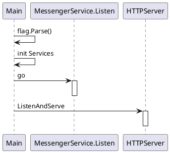
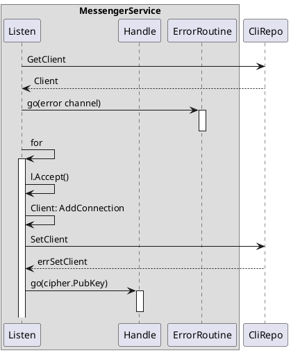
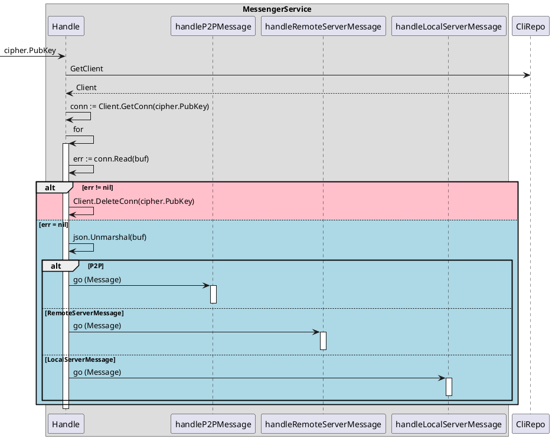
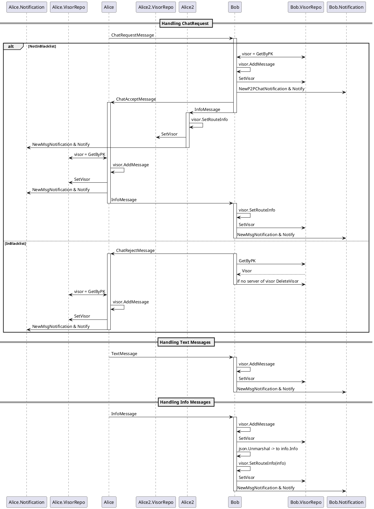

# Skywire Chat App

Chat implements basic text messaging between skywire visors.

It is possible to send messages p2p or in groups.

The group feature is structured in a way that it is possible for everyone to host and join multiple servers.

Those servers are structured like that:

  - Public Key of Visor
    - Public Key of Server 1
      - Public Key of Room 1.1
      - Public Key of Room 1.2
      - ...
    - Public Key of Server 2
      - Public Key of Room 2.1
      - Public Key of Room 2.2

And the chats are adressed with a so called public key route (pkroute):
  - Route to a Room = [PK of Visor, PK of Server, PK of Room]
  - P2P Route       = [PK of Visor, PK of Visor, PK of Visor]

Messaging UI is exposed via web interface.

Chat only supports one WEB client user at a time.

# Development Info
The app is written with 'Clean Architecture' based on the blog entry of Panayiotis Kritiotis [Clean Architecture in Go](https://pkritiotis.io/clean-architecture-in-golang/)

To get a basic understanding on how it is structured, reading the blog will help.

## Sequence Diagrams
### Init

### MessengerService.Listen

### MessengerService.Handle

### MessengerService.handleP2PMessage

### MessengerService.handleRemoteServerMessage (This is the client-side handling of servers)
TODO
### MessengerService.handleLocalServerMessage (This is the server-side handling of servers)
TODO

### Usecases
TODO
