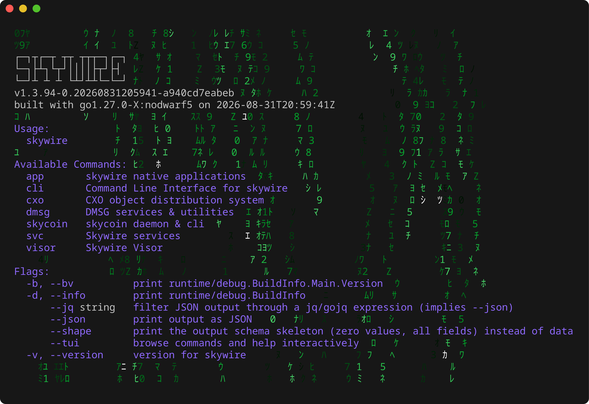

# Skywire documentation

Skywire is a peer-to-peer privacy-focused networking suite developed
by Skycoin. Visors are reachable over two encrypted networks — Skywire
(direct routing) and DMSG (relay) — addressed by 33-byte public keys.

This site collects everything an operator or developer needs to run,
extend, or understand a Skywire deployment.

Everything ships in one binary. `skywire --help` is the top of the
command tree:



And `skywire --tui` opens an interactive browser of every command and
its help text — any command can be run straight from it:


To try it right now without installing anything, open the
**[Playground](playground/)** — the same binary compiled to
WebAssembly, running in a browser terminal.

## Where to start

<div class="grid cards" markdown>

- :material-play-circle: **[Playground](playground/)**

    Try skywire without installing anything: the whole binary compiled
    to WebAssembly behind a browser terminal. Run `skywire autoconfig`
    in it to boot a real visor in the tab, then open its hypervisor UI
    at `http://127.0.0.1:8001` in the nested browser. The
    **`>_ playground`** button (bottom right of every page) opens it in
    a drawer that keeps running while you read the docs.

- :material-rocket-launch: **[Guides](guides/)**

    Install, configure, and operate a visor. VPN, SOCKS5, SkyNet
    port forwarding, manual routing, hypervisor UI.

- :material-console: **[Command Reference](skywire/)**

    Every `skywire <subcommand>` page with flags, usage, examples,
    and live sample output. Generated from the cobra tree with
    `make doc-gen`.

- :material-book-open-page-variant: **[Specs](specs/)**

    Protocol-level specifications: transports, packets, routing,
    setup-node, hypervisor architecture, address-resolver privacy.

- :material-trophy-outline: **[Rewards](rewards/)**

    Eligibility rules for the Skywire reward distribution.

- :material-graph-outline: **[Code Graph](graph/)**

    The source as a three-dimensional map — every function and type a
    node, every call an edge. A way to see the shape of the codebase.

</div>

!!! note "Per-app and per-service docs"

    The visor-hosted apps — **[PTY](pty/README.md)**,
    **[Skychat](skychat/README.md)**, **[SkyNet](skynet/README.md)**,
    **[SOCKS5 proxy](skysocks/README.md)**, and **[VPN](vpn/README.md)** —
    now have full guides in the **Apps** section above. The deployment
    services (transport-discovery, route-finder, service-discovery,
    address-resolver, uptime-tracker) still live alongside the source under
    [`cmd/svc/`](https://github.com/skycoin/skywire/tree/develop/cmd/svc)
    and will be integrated here in a follow-up.

## Other resources

- [Skycoin Blog](https://blog.theskywirenetwork.net) — release notes,
  protocol updates, and ecosystem news
  ([mirror: skycoin.github.io/blog](https://skycoin.github.io/blog))
- [Source on GitHub](https://github.com/skycoin/skywire)
- [Telegram](https://t.me/skywire)
- [Skywire Wiki](https://github.com/skycoin/skywire/wiki) — operator
  walkthroughs, troubleshooting, package install guides
- [skywire-deployment](https://github.com/skycoin/skywire-deployment) —
  run your own deployment of the discovery / route-finder / uptime
  services

## Regenerating this site

The command-reference subtree (`docs/skywire/`) is generated from the
live cobra tree by the hidden `skywire doc` subcommand. Regenerate
after CLI changes:

```
make doc-gen
```

The site itself builds via the `Docs` GitHub Actions workflow on every
push to `develop`, deploying to the `gh-pages` branch. For local
preview:

```
make docs-serve
```
