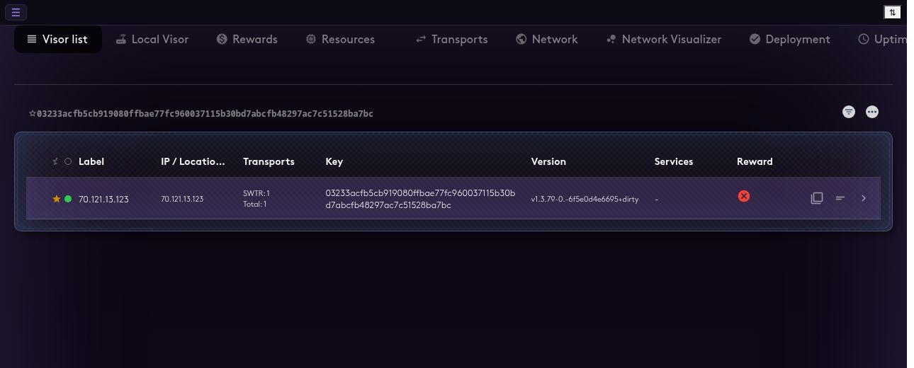
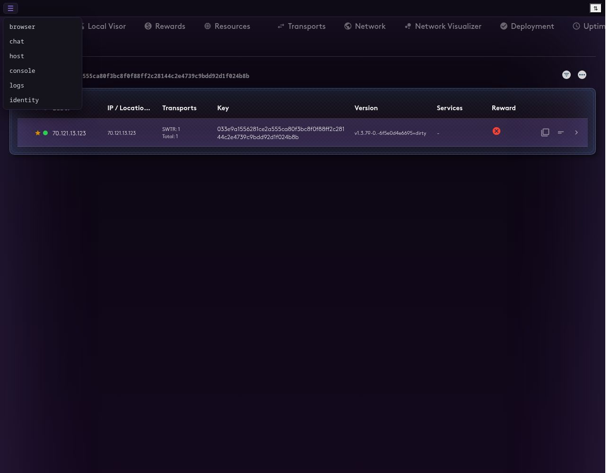
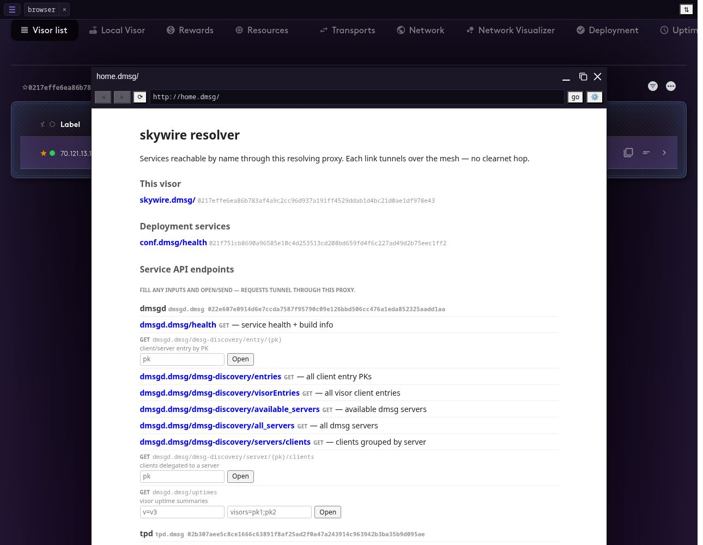
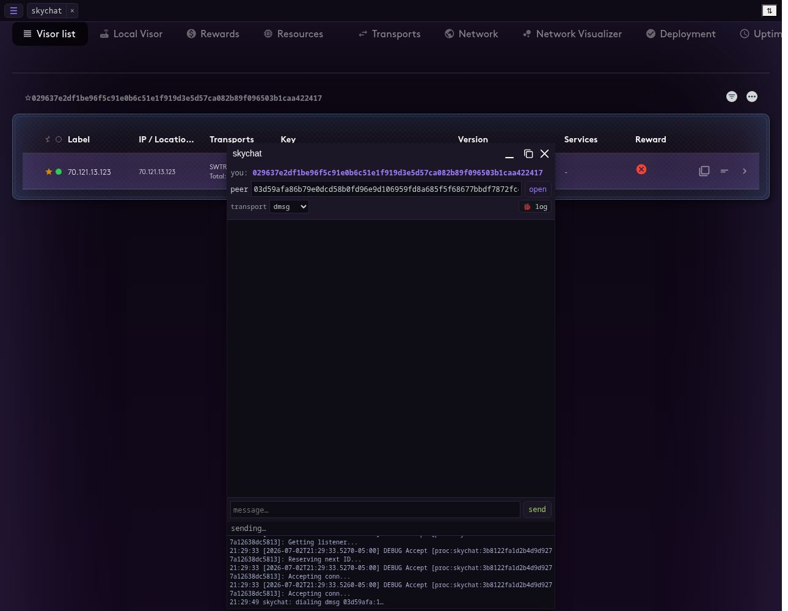
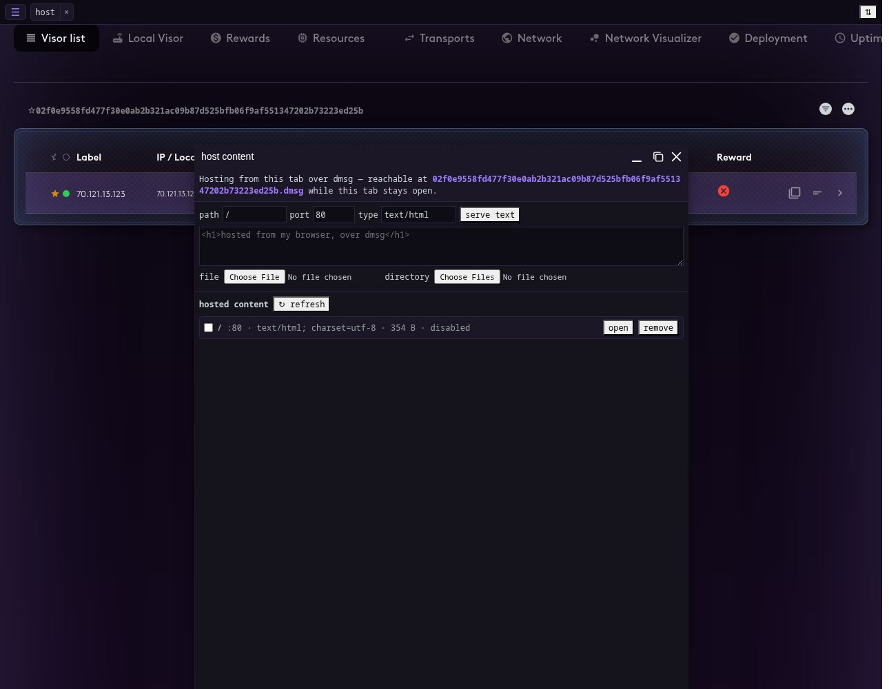
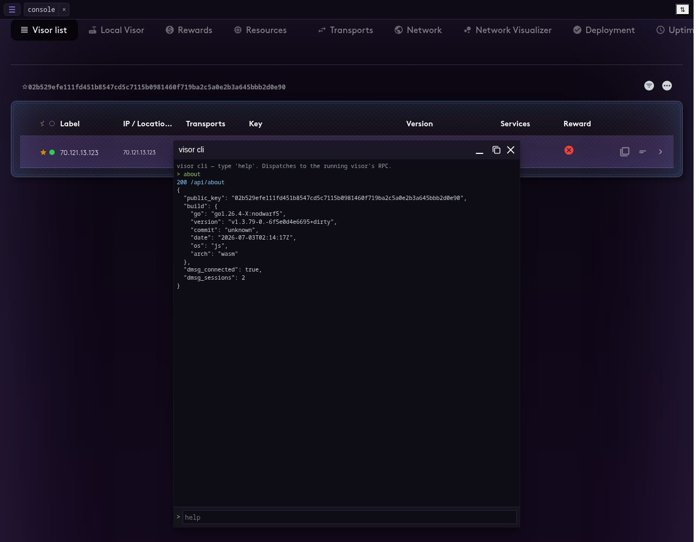
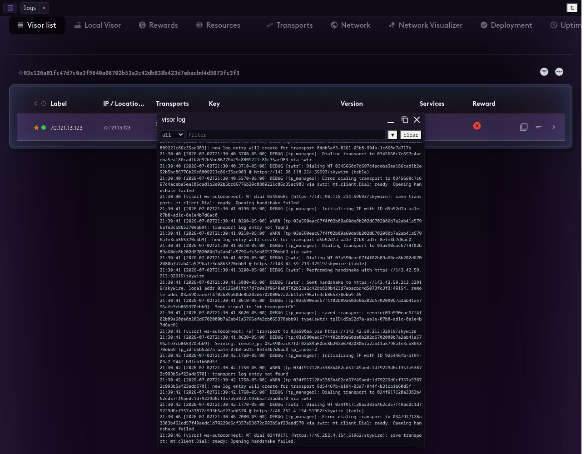

# The wasm-visor UI — a visual tour

The **wasm-visor** is a full Skywire visor **and** hypervisor UI that runs entirely
inside a browser tab, compiled to WebAssembly (`GOOS=js GOARCH=wasm`). No install,
no daemon, no filesystem — it dials into the Skywire network over dmsg-over-WebSocket
/ WebTransport / WebRTC, registers in discovery, and carries real transports. This
page is a screenshot tour of its interface.

Screenshots were captured headless against a live standalone wasm-visor (served by
`skywire cli hv serve`, see below) using `cmd/hvinspect`. Each browser session
generates a fresh ephemeral identity, so the public key differs between shots.

> Serving it: `skywire cli hv serve --tls` builds the single-file page from the
> embedded wasm + UI and serves it over HTTPS. Open the URL, accept the local
> cert once, and the visor boots in the tab. (The public deployment is
> https://skywire.theskywirenetwork.net.)

---

## 1. The dashboard (visor list)



On boot the tab **is** a visor: it appears as the self entry in the visor list with
its public key, self-reported public IP (via STUN), transport count, and build
version. The top tabs are the same hypervisor surfaces as the native UI — Visor
list, Local Visor, Rewards, Resources, Transports, Network, Network Visualizer,
Deployment, Uptime — driven here by the in-wasm visor core rather than a remote
RPC. The version string carries `os:js arch:wasm`, the tell-tale of a browser visor.

---

## 2. The mini-desktop app menu



The wasm-visor adds a **WinBox mini-desktop**: a taskbar with a ☰ launcher opening
draggable, resizable windows over the dashboard. The app menu offers:

- **browser** — the skynet/dmsg virtual browser (multi-instance)
- **chat** — a 1:1 skychat client (wasm-visor only)
- **host** — serve content from this tab over dmsg (wasm-visor only)
- **console** — a REPL over the visor's API
- **logs** — the live visor log
- **identity** — the visor's keys / mode

`chat` and `host` appear only on the wasm-visor (they use in-tab JS hooks the
native HV UI doesn't expose); the native UI has its own Angular skychat tab.

---

## 3. Skynet browser



A virtual browser that fetches over Skywire by **public key**, not DNS/IP. Typing
`home:dmsg` (shown) lands on the visor's own resolver page listing reachable
services (`sd.dmsg`, `ar.dmsg`, the deployment discovery services, …). It can
browse `dmsg://<pk>` and `<pk>.dmsg` sites via the resolving proxy, and clearnet
via a skysocks-lite exit — each window has its own activity-log pane showing the
resolving-proxy / skysocks route setup.

---

## 4. Skychat



A 1:1 chat client that talks to any visor running skychat, over the wasm-visor's
own dmsg client. Notable controls:

- **peer** — paste the other visor's public key; distinct senders from the buffer
  surface as clickable chips so an incoming message from an unknown peer is
  discoverable.
- **transport** — send over **dmsg** (direct) or **skynet** (routed).
- **🐞 log** — a collapsible activity pane showing skychat's own
  dial/connect/send/receive steps (here: `skychat: dialing dmsg <pk>:1…`), the same
  way the browser window surfaces its proxy route setup.

Messages are Noise-encrypted end to end; the wire is a length-prefixed frame
(shared codec in `pkg/skychat/message`).

---

## 5. Host content



The tab can **serve content over dmsg** while it's open — reachable at
`<this-pk>.dmsg:<port>` by any visor. Add a text page, upload files, or a whole
directory; each path is listed with its content type, size, and an enable/disable
toggle. This is a website with no server, no domain, and no IP — addressed purely
by public key. (Demonstrated cross-visor: a native visor's browser can open a page
hosted from a browser tab here.)

---

## 6. Console



A REPL that dispatches to the running visor's API — `about`, `visors`, `net`,
`app ls`, `tp ls`, `route ls`, or `raw <M> <path>`. In the wasm-visor these are
in-process function calls (`hvApi()`), so it works even in a standalone PWA with
no shell. Shown: `about` returning the build (`os:"js"`, `arch:"wasm"`),
`dmsg_connected: true`, and the live dmsg session count.

---

## 7. Logs



A live view of the visor log — the captured console ring buffer — with a level
filter and text filter. The operator can watch dmsg connects, transport setup,
route origination, telemetry, and app activity without browser devtools or a shell.

---

## Regenerating these screenshots

They're captured with `cmd/hvinspect` (headless Brave via chromedp) against a
running harness:

```
skywire cli hv serve --tls --harness --addr :8443     # serve the wasm-visor
HVINSPECT_EVAL='<open-a-window JS>' \
  cmd/hvinspect/hvinspect https://localhost:8443/ 16 /tmp/shot   # boot + screenshot
convert /tmp/shot.png -crop 1290x1000+0+0 +repage docs/img/wasm-visor/<name>.png
```
