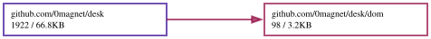

# desk

Windows over panes, in WebAssembly. A small desktop shell for the browser:
[winbox-go](https://github.com/0magnet/winbox-go) supplies the windows,
[websh](https://github.com/0magnet/websh) supplies a shell, and a pane is
anything that renders into a DOM element.

**[Live demo](https://0magnet.github.io/desk/)** · TinyGo build ·
[standard Go build](https://0magnet.github.io/desk/go/)

```
desk:~$ echo hello > note.txt && view note.txt    a command opens a window
desk:~$ open files                                or use the menu, bottom left
```

## What it is

```
desk.go            the registry: apps, windows, mounting, teardown
panel.go           the panel — Applications menu, task buttons, clock
compositor.go      the optional WebGL path: what to draw, where, in what order
compositor_js.go   the same path's WebGL2 calls
dom/               element building without the syscall/js ceremony

panes/                    a second module — see below
panes/term                a websh shell
panes/files               a file manager
panes/viewer              an image and text viewer, plus the `view` command
panes/cmd/desk            the demo
panes/cmd/desk-serve      a native binary that serves it, assets embedded

panes/hostproto           the wire between a pane and the machine
panes/hostagent           the half that runs on the machine: a pty, and files
panes/hostterm            a pane that is a real shell on the machine
panes/hostfs              the machine's filesystem, as an afero.Fs
```

The shell knows nothing about terminals, images or files. A pane is:

```go
type Pane interface {
	Mount(el js.Value) error
	Close()
}
```

An app that a page opens with should set `Maximized`, so the desktop starts
with something filling it rather than a small window adrift in empty space.

`Resizer` is optional and most panes do not want it — one laid out with CSS is
resized by the browser, and one that watches its own element hears about it from
a `ResizeObserver`. The terminal pane does not implement it.

That is the point of the arrangement: a project brings its own pane rather than
waiting for this package to grow support for it.

## Compositing in WebGL, optionally

Off by default, and one call to turn on:

```go
if err := desk.EnableCompositing(); err != nil {
	// nothing has changed; the desk is the DOM desktop it already was
}
```

The DOM cannot be sampled into a WebGL texture, so compositing arbitrary panes
in WebGL would mean reimplementing layout, text and input in GL — a UI toolkit,
and not this project. A canvas *can* be a texture: `texImage2D` takes an
`HTMLCanvasElement` directly. So a pane says whether it is one:

```go
type TexturePane interface {
	Canvas() js.Value
}
```

A terminal running xterm-go's WebGL renderer has every glyph it shows in one
canvas, so `panes/term` implements it. Panes that do not are untouched.

Composited windows are drawn as textured quads with their chrome as flat
geometry; the DOM windows stay underneath at `opacity: 0`, so dragging,
resizing, focus and the keyboard are still the DOM's job and the compositor is
only a repaint. The title *text* is not drawn — the panel still has it.

Everything falls back, per frame and per window: no WebGL2 context, a pane that
is not canvas-backed, a canvas not sized yet, a lost context, or any exception
out of a GL call, and the window concerned — or the whole desk — is on the DOM
path again with one style property. The GL layer sits above every window and
below the panel, which is why only an unbroken run at the top of the stack is
composited: a composited window would otherwise paint over a DOM window that is
supposed to be in front of it.

## Two modules

The desk requires `winbox-go` and nothing else. It is a window manager, a
panel and a registry, and it does not know that a shell exists.

The panes are a separate module because each is an adapter that knows both
sides — `panes/term` knows the desk and websh. Putting that in the desk would
make a window manager require a shell; putting it in websh would make a shell
require a window manager. It belongs to neither, so it lives in its own module
next to what it adapts.

The two commands are there too, since both compose rather than provide. What
that buys: `go get github.com/0magnet/desk` brings winbox-go, and nothing
else — no shell, no filesystem, no interpreter.

They are developed together and released separately. The `replace` in
`panes/go.mod` points at `../` and is ignored by anything that depends on the
module, which is how a nested module is normally arranged.

## Running it

```
(cd panes && go run ./cmd/desk-serve)  # serves the built demo, opens a browser
./build.sh                       # rebuild both          -> docs/ and docs/go/
./build.sh tinygo                # TinyGo only
./build.sh go                    # standard Go only
```

Both toolchains are carried. TinyGo is the default because the binary is a
quarter the size and is fetched before anything appears; the standard Go build
is a click away in the page header, because TinyGo occasionally miscompiles
something and having the other one to hand is how you find out that is what
happened.

`desk-serve` embeds `docs/`, so it needs no checkout and no network. It exists
because a wasm page cannot be opened over `file://` — the browser refuses to
instantiate a module fetched that way — and because a wrong `Content-Type` on
the `.wasm` makes `instantiateStreaming` fail with an error that mentions
nothing about MIME types.

## Reaching the machine

The desk is a desktop environment that could touch nothing: its shell is websh,
a Bash interpreter compiled to wasm, and its filesystem is an in-memory afero
kept in IndexedDB. All of it works and none of it is yours. Two flags change
that, and both are off:

```
(cd panes && go run ./cmd/desk-serve --shell)          # a real pty in a window
(cd panes && go run ./cmd/desk-serve --fs)             # real files
(cd panes && go run ./cmd/desk-serve --fs --fs-root ~) # ...confined to a subtree
```

`--shell` adds the **host shell** app: xterm-go in a window, attached over a
WebSocket to a pty running your `$SHELL`. It resizes with the window, because a
resize becomes a `TIOCSWINSZ` and so a `SIGWINCH`, which is what makes a
full-screen program redraw.

`--fs` is the one that does more than it looks like. websh's shell and the file
manager both work against `afero.Fs`, an **interface**, and websh takes any
implementation — so a single host-backed `afero.Fs` makes the file manager list
real directories *and* gives the wasm shell real files: `ls`, `cat`, `grep`,
globbing, redirection. The interpreter still runs in the tab; only what it reads
and writes stops being imaginary. It is three lines in `cmd/desk`, and nothing
below them knows which filesystem it got.

`/bin` stays synthetic. websh writes a stub there for every applet so `ls /bin`
shows the command set, which is right for a filesystem in a tab and would
otherwise scatter fifty empty files into a home directory; `hostfs.Mount` routes
that one path to memory and everything else to the machine.

### On a machine with other people on it

The token above is injected into the served page, which is frictionless and
exactly right when the only person who can read that page is you. It is not
right on a shared box, and the reason is worth being precise about: **the
Origin check does not stop a local process.** It stops a hostile web *page*,
because a browser sets `Origin` itself and script cannot change it — but
anything that is not a browser simply sends whatever header it likes. So
another user can fetch the page, read the token out of it, forge an `Origin`,
and have a shell as you.

```
(cd panes && go run ./cmd/desk-serve --shell --auth)
```

`--auth` prints the token to the terminal that started the server and leaves it
out of the page. Opening the **host shell** app then asks for it, in the
terminal itself, and remembers it in `sessionStorage` for the rest of the tab.
A wrong one is refused and it asks again.

There is deliberately **no `--password` flag**. A password on a command line is
not a secret: `/proc/<pid>/cmdline` is readable by other users on exactly the
machines where this threat exists, so the flag would hand the password to the
attacker it was meant to stop. The secret is generated, and only ever travels
from the server's own terminal to the person reading it.

It asks in the pane rather than in a `window.prompt()`, which is what it did
first and was wrong twice over: a native dialog blocks the whole page before
anything is on screen, and it demands a token from everyone whether or not they
were going to open a shell.

### What this costs, said plainly

A browser tab that can run commands as you is the most valuable target on the
machine, and any page you visit may try to reach localhost. So:

- nothing is served unless `--shell` or `--fs` is passed;
- either flag with a **non-loopback** listener is refused outright, not warned
  about;
- the `Origin` must match a page this listener served — and for ordinary
  requests `Sec-Fetch-Site` is checked, because a browser does **not** send
  `Origin` on a same-origin GET, so requiring one refuses exactly the traffic
  the check exists to permit;
- a token from `crypto/rand`, per run, never written to disk — injected into
  the page by default, or printed to the terminal instead with `--auth`;
- `--fs-root` confines paths for real: they are resolved through
  `EvalSymlinks` on the longest **existing** prefix, so a symlink planted inside
  the root cannot be followed out of it.

The Origin check is the load-bearing one and the token is honestly the weaker
guard: a browser sets `Origin` itself and script cannot forge it, whereas a
local process running as you can read the token out of the served page — and
such a process already has your shell without asking this one. Defense in
depth, not a boundary. A zero `Config` refuses everything.

Stopping the server revokes both.

## The filesystem is the channel

Every pane shares one [afero](https://github.com/0magnet/afero) filesystem, so
handing a file from one window to another needs no message passing:

```
desk:~$ view report.svg
```

`view` only has to name the file. Writing it *was* the hand-off. The file
manager opens files the same way, through `desk.Lookup("viewer")` rather than
knowing what a viewer is — so registering a better viewer replaces it
everywhere at once.

## Fitting

A terminal in a window is resized by its container, never by the browser
window, so a `window.resize` listener never hears about it. xterm-go's
`AutoFit` observes the parent element instead:

```
window body  760x425  ->  terminal canvas  738x420
window body 1000x565  ->  terminal canvas  981x560
window body  500x285  ->  terminal canvas  477x280
```

## What it does not do

No workspaces, no session management, no multi-monitor, no file operations
beyond browsing. Nothing here is a sandbox: with `--shell` the pty is your
account, and `--fs` without `--fs-root` is your whole filesystem — which is the
right default only because `--shell` already implies it, and a fence beside an
open gate is not a fence. The panel and the menu are what make a collection of windows
read as a desktop; the rest is refinement on top of those two.
## Dependency Graph

Made with [goda](https://github.com/loov/goda):

```
# GOOS=js: the import edges of a wasm program live in js/wasm-tagged
# files and are invisible to a host-context run
GOOS=js GOARCH=wasm go run github.com/loov/goda@latest graph github.com/0magnet/desk/... | dot -Tsvg -o docs/desk-goda-graph.svg
```



## Lines of Code

Made with [gocloc](https://github.com/hhatto/gocloc) (excludes `vendor/`, `node_modules/`, `.git/`):

```
gocloc --not-match-d='(vendor|node_modules|\.git)' .
```

```
-------------------------------------------------------------------------------
Language                     files          blank        comment           code
-------------------------------------------------------------------------------
Go                              33            733           1573           5226
JavaScript                       2            117             82            935
Markdown                         1             62              0            229
YAML                             1              0              7             98
HTML                             2              0              0             92
Makefile                         1             19             31             86
Bourne Shell                     2             13             29             50
JSON                             2              0              0             28
-------------------------------------------------------------------------------
TOTAL                           44            944           1722           6744
-------------------------------------------------------------------------------
```
